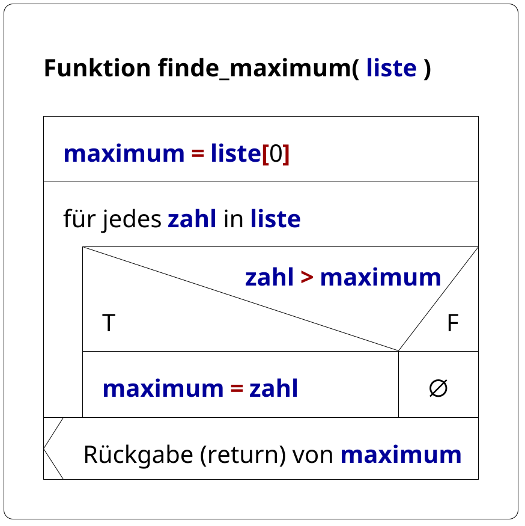
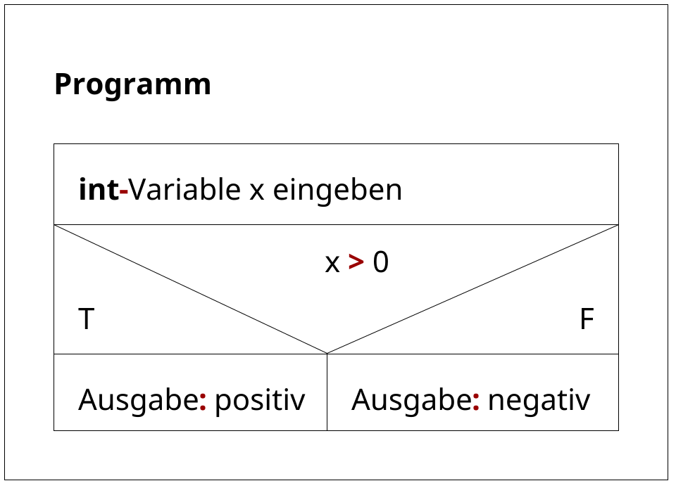
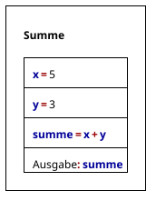
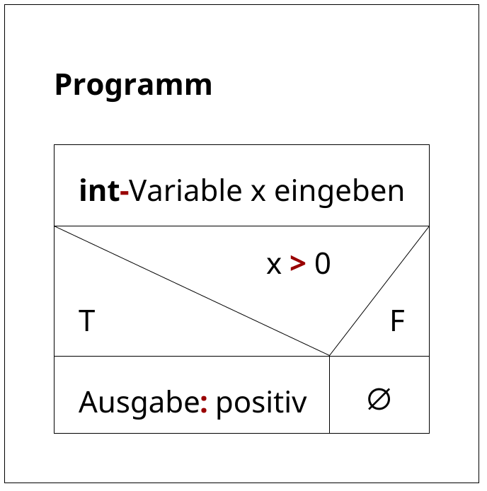
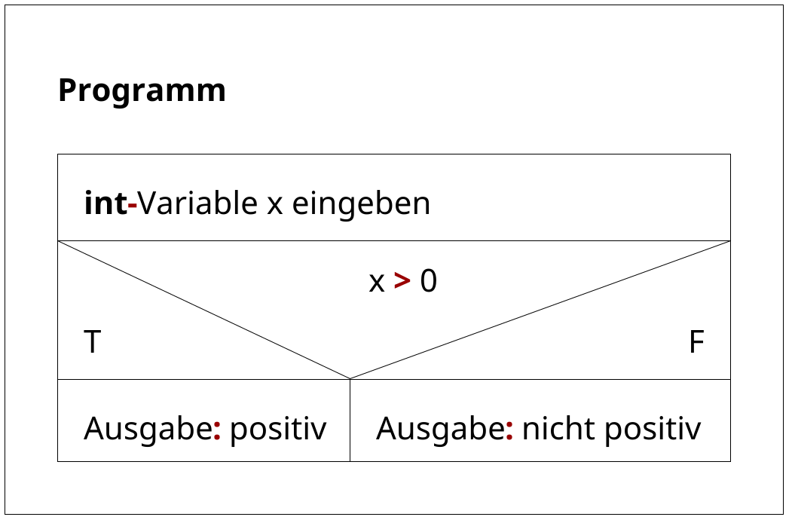
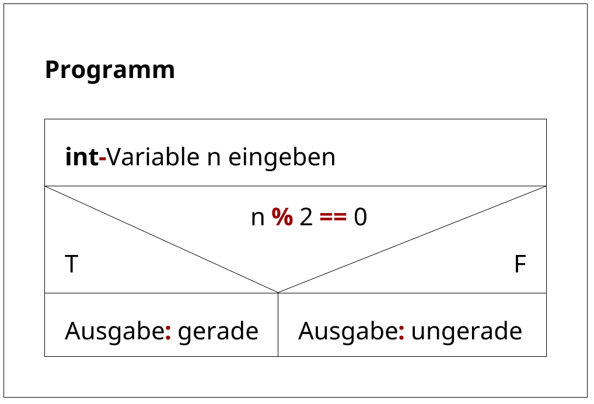
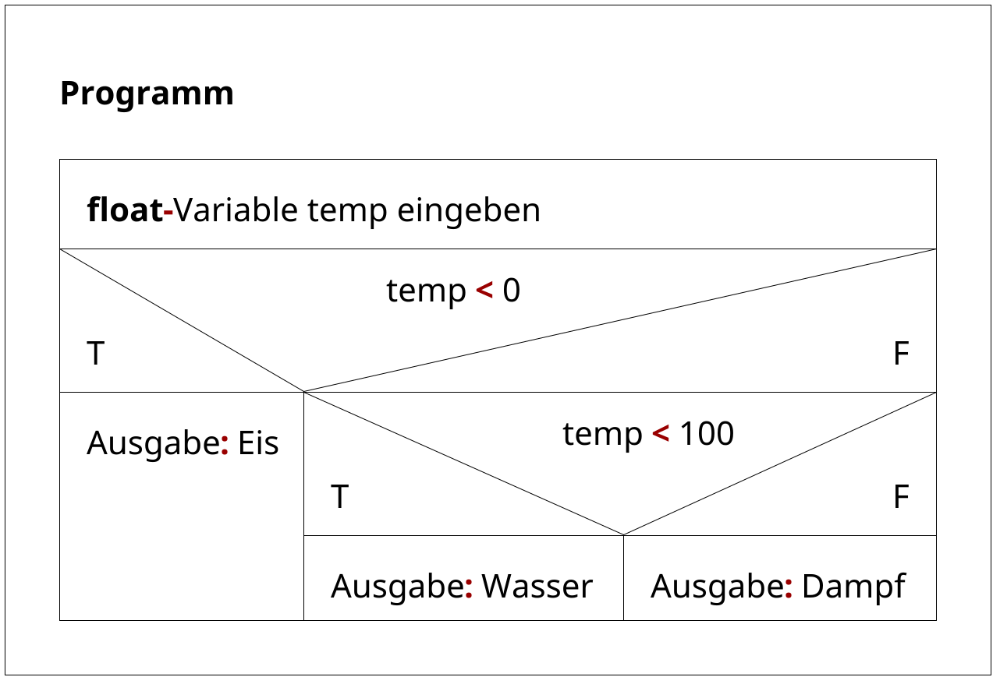
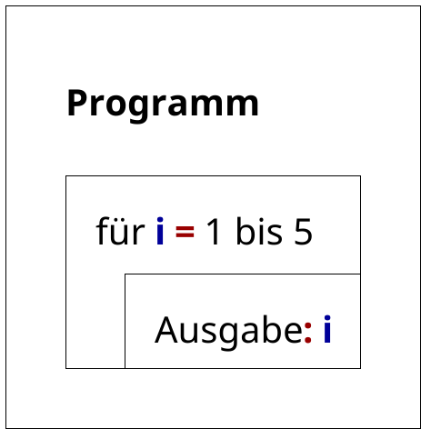
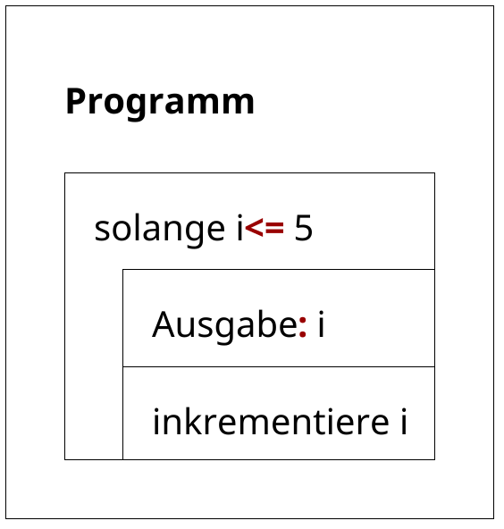
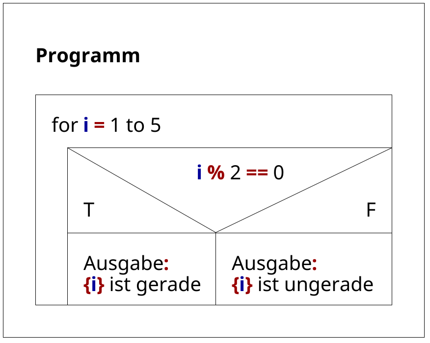

# Programmieren

**Ingenieurinformatik Teil 1, Wintersemester 2025/26**

David Straub

## Gliederung

1. Einführung
2. [Grundlagen: Variablen, Datentypen, Verzweigungen](#grundlagen)
3. [Funktionen](#funktionen)
4. [Schleifen](#schleifen)
5. [Datenstrukturen](#datenstrukturen)
6. [Module & Bibliotheken](#module--bibliotheken)
7. [Algorithmen, Pseudocode & Struktogramme](#algorithmen-pseudocode--struktogramme)
8. [Arbeiten mit Zeichenketten](#arbeiten-mit-zeichenketten)
9. [Visualisierung von Funktionen](#visualisierung-von-funktionen)
10. [Zahlensysteme](#zahlensysteme)
11. Klassen
12. Numerisches Programmieren in Python

## Einführung

1. ~~Warum Programmieren?~~
2. ~~Organisatorisches~~
3. Warum Python?
4. Python installieren


### Warum Python? Einfachheit


Python:

```python
print("Hallo Welt!")
```

Java:

```java
public class HelloWorld {
    public static void main(String[] args) {
        System.out.println("Hallo Welt!");
    }
}
```

### Einfachheit: Liste der Quadrate der Zahlen von 0 bis 9

Python:

```python
quadrate = [x**2 for x in range(10)]
```

Fortran:

```fortran
program quadrate
implicit none
integer :: i
integer, dimension(10) :: quadrate
do i = 0, 9
    quadrate(i+1) = i**2
end do
end program quadrate
```

### Beliebtheit


Quelle: [TIOBE](https://www.tiobe.com/tiobe-index/)

### Warum Beliebtheit wichtig ist

- Mehr Bibliotheken
- Mehr Dokumentation
- Mehr Jobs
- Bessere KI-Unterstützung

### Mythen über Python

Früher verbreitete Mythen über Python:

- Nur für Skripting
- Nur für Anfänger
- Langsam


Heute:

- Industriestandard für ML/AI
- Standard für wissenschaftliches Rechnen
- Weit verbreitet in Webentwicklung, Automatisierung, uvm.


### Zusammenfassung: Warum Python?

- Sehr einfach
- Extrem beliebt
- Weit verbreitet in Industrie und Wissenschaft
- Quelloffen & kostenlos


### Python installieren

- Anders als z.B. C++ ist Python eine *interpretierte* Programmiersprache, d.h. der Code wird zur Laufzeit Zeile für Zeile ausgeführt. 
- Das ausführende Programm heißt *Interpreter* und ist für alle gängigen Betriebssysteme verfügbar.

Anleitung:

- Windows: https://www.python.org/downloads/windows/ – herunterladen & installieren
    - oder einfach [WSL](https://learn.microsoft.com/de-de/windows/wsl/install)
- Ubuntu: `sudo apt install python3 python3-pip`
- MacOS: `brew install python`

Bitte *kein* Anaconda …

### Versionsgeschichte

| Version | Veröffentlichung    | EOL |
|---------|---------------------|-----|
| 3.9     | 2020-10             | **2025-10** |
| 3.10    | 2021-10             | 2026-10 |
| 3.11    | 2022-10             | 2027-10 |
| 3.12    | 2023-10             | 2028-10 |
| 3.13    | 2024-10             | 2029-10 |
| 3.14    | **2025-10**         | 2030-10 |

- Details: [Status of Python Versions](https://devguide.python.org/versions/)
- Diese Veranstaltung: Python 3.10 oder höher (3.12 oder 3.13 empfohlen)

### Konsole, Skript, Notebook

- Konsole: interaktive Eingabe von Python-Befehlen
    - nützlich als schneller Taschenrechner
- Skript: Python-Code in einer Datei mit der Endung `.py`
    - nützlich für längere Programme
- Jupyter Notebook: interaktive Umgebung für Datenanalyse und Visualisierung
    - nützlich für explorative Programmierung


### Python ausprobieren, ohne es zu installieren

- Python Online: https://pythononline.net/
- JupyterLite: https://jupyter.org/try
- FK07 DataHub (JupyterHub): https://datahub.cs.hm.edu/
- Github Codespaces: https://github.com/DavidMStraub/python-codespace


### One-Minute-Paper

Moodle: https://link.hm.edu/y4vj

- Schreiben Sie 3 Dinge auf, die Sie heute gelernt haben
- Was war am unklarsten?
- Gibt es etwas spezielles, das Sie in diesem Kurs lernen möchten?


## Grundlagen

1. Variablen
2. Einfache Datentypen (`int`, `bool`, `float`, `str`)
3. [Verzweigungen](#verzweigungen)

### Variablen

Variablen speichern Werte:

```python
x = 42
y = x
x = 100
print(y)
```

```python
print(x)
```

### Variablennamen: Fallstricke

```python
# class = "Mathematik"  # SyntaxError!
klass = "Mathematik"
print(klass)
```

```python
# Schlecht lesbar:
l = 1
I = 1  
O = 0
print(l, I, O)
```

### Namen: Konventionen

```python
# Variablen & Funktionen: snake_case 🐍
first_name = "Alice"
calculate_average()

# Konstanten: UPPER_SNAKE_CASE 📢
MAX_SIZE = 100
API_KEY = "secret"

# Klassen: PascalCase 🏛️
class UserAccount:
    pass

# Privat: führender Unterstrich 🔒
_internal_value = 42
__very_private = "secret"
```

### Ganze Zahlen (int)

Integers haben unbegrenzte Präzision:

```python
riesig = 2 ** 1000
print(len(str(riesig)))
```


```python
print(riesig % 1000)
```


### Division & Integers

```python
print(10 / 3)
```


```python
print(type(10 / 3))
```


```python
print(10 // 3)
```


```python
print(-10 // 3)
```


### Wahrheitswerte (bool)

Booleans sind eigentlich Integers:

```python
print(True + True)
```


```python
print(True * 42)
```


```python
print(False - True)
```

### Vergleichsoperatoren
```python
print(5 == 5)
```

```python
print(5 != 3)
```

```python
print(10 > 5)
```

```python
print(5 >= 5)
```

```python
print("Python" > "Java")  # Lexikografischer Vergleich
```


### Truthiness: Was ist wahr?

```python
print(bool(0))
```


```python
print(bool(42))
```


```python
print(bool(""))
```


```python
print(bool("0"))
```


### Vergleichsoperatoren: Chaining

```python
x = 5
print(1 < x < 10)
```


```python
print(10 < x < 20)
```


```python
print(1 < x > 3)
```

### Logische Operatoren

```python
print(True and False)
```

```python
print(True or False)
```

```python
print(not True)
```

```python
print(not False)
```

```python
print(not 0)
```

```python
print(not "")
```


### Kurzschlussauswertung

```python
print(False and 1/0)
```


```python
print(True or 1/0)
```


```python
print(0 and print("Hallo"))
```


### Gleitkommazahlen (float)

IEEE 754 Double Precision Fallstricke:

```python
print(0.1 + 0.1 + 0.1)
```


```python
print(0.1 + 0.1 + 0.1 == 0.3)
```


```python
x = 0.1
print(f"{x:.20f}")
```

### Vergleich von Gleitkommazahlen

```python
a = 0.1 + 0.1 + 0.1
b = 0.3
tolerance = 1e-10
print(abs(a - b) < tolerance)
```


### Extreme Werte

```python
print(1e308)
```


```python
print(1e309)
```


```python
print(1e-324)
```


```python
print(1e-325)
```


### Strings

```python
# Verschiedene Anführungszeichen
single = 'Hallo'
double = "Welt"
print(single + " " + double)
```

```python
triple = """Mehrzeiliger
String"""
print(triple)
```


### Strings und Unicode: Emoji

```python
# Strings unterstützen vollständig Unicode
message = "Python ist toll! 🐍✨"
print(message)
```

```python
# Emoji sind normale Zeichen
emoji_string = "🚀🌟💻"
print(len(emoji_string))
```


### Escape Sequences

```python
print("C:\new_folder\test.txt")
```


```python
print(r"C:\new_folder\test.txt")
```


```python
print("Zeile 1\nZeile 2\tTab")
```

### String-Formatierung mit f-Strings

```python
name = "Alice"
age = 25
print(f"Hallo, ich bin {name} und {age} Jahre alt")
```

Vorteile gegenüber älteren Methoden:
- Lesbar und intuitiv
- Direkte Variableneinbettung
- Schneller als `.format()` oder `%`-Formatierung
- Unterstützt Ausdrücke: `f"Das Ergebnis ist {x + y}"`


### f-String Formatierung

```python
number = 1234567.89
print(f"{number:,.2f}")
```


```python
print(f"{number:>15,.2f}")
```


```python
percent = 0.1234
print(f"{percent:.1%}")
```


### Aufgabe: Persönlicher Datenrechner

Schreibe ein Python-Skript, das persönliche Daten verarbeitet:

**Gegeben:**
- Name, Geburtsjahr, Größe (cm), Gewicht (kg)

**Berechne und gib aus:**
- Alter (aktuelles Jahr: 2025)
- BMI (Gewicht / (Größe in m)²)
- Personendaten als formatierte f-Strings
- Wahrheitswerte für: ist volljährig, ist normalgewichtig (BMI 18,5-24,9)


### Kontrollstrukturen: Übersicht

**Was sind Kontrollstrukturen?**
- Mechanismen zur Steuerung des Programmflusses
- Bestimmen die Reihenfolge der Befehlsausführung
- Ermöglichen komplexe Programmlogik

**Grundtypen:**
1. **Sequenz** – Befehle nacheinander (Standard)
2. **Verzweigung** – Bedingte Ausführung (`if`, `elif`, `else`)
3. **Wiederholung** – Schleifen (`for`, `while`)


### Verzweigungen

**Konzept:**
- Programme müssen Entscheidungen treffen
- Verschiedene Pfade basierend auf Bedingungen
- Ermöglicht adaptive und intelligente Programme

**Syntax-Muster:**
```python
if bedingung1:
    # Code wenn bedingung1 wahr
elif bedingung2:
    # Code wenn bedingung2 wahr  
else:
    # Code wenn keine Bedingung wahr
```

### Verzweigungen: Wichtige Konzepte

- Einrückung (Indentation) definiert Codeblöcke
- Bedingungen werden von oben nach unten geprüft
- Nur der erste wahre Zweig wird ausgeführt


### Verzweigungen: Truthiness in der Praxis

```python
name = ""
if name:
    print("Name ist vorhanden")
else:
    print("Kein Name angegeben")
```


```python
name = "Alice"
if name:
    print("Name ist vorhanden")
else:
    print("Kein Name angegeben")
```


### Komplexe Bedingungen

```python
age = 17
has_id = True
if age >= 18 and has_id:
    print("Einlass gewährt")
elif age >= 16:
    print("Einlass mit Begleitung")
else:
    print("Kein Einlass")
```


```python
age = 20
has_id = False
if age >= 18 and has_id:
    print("Einlass gewährt")
elif age >= 16:
    print("Einlass mit Begleitung") 
else:
    print("Kein Einlass")
```

### Aufgabe

Schreibe ein Python-Programm um zu entscheiden, ob eine Rakete starten darf.

**Eingaben:**
- Treibstoff (%), Temperatur (°C), Crew (ja/nein), Wetter

**Startbedingungen:**
- Treibstoff ≥ 70%, Temperatur < 100°C, Crew bereit, Wetter ≠ "storm"

**Ausgabe:**
- ✅ "🚀 Startfreigabe erteilt!" oder ❌ "Start abgebrochen!" + Grund


## Funktionen

### Kapselung von Komplexität

&nbsp;

> The greatest limitation in writing software is our ability to understand the systems we are creating.
>
> …
>
>There are two general approaches to fighting complexity … The first is to eliminate complexity by making code **simpler and more obvious**. … The second is to **encapsulate it**, so that programmers can work on a system without being exposed to all of its complexity at once.

&nbsp;

John Ousterhout, “A Philosophy of Software Design”


### Warum Funktionen? 

Das DRY-Prinzip: **"Don't Repeat Yourself"**

```python
FOOT = 0.3048
NAUTICAL_MILE = 1852.0

altitude_ft = 35000
altitude_m = altitude_ft * FOOT  # Flughöhe
print(f"Flughöhe: {altitude_ft} ft = {altitude_m:.0f} m")

distance_nm = 450
distance_m = distance_nm * NAUTICAL_MILE  # Strecke
print(f"Strecke: {distance_nm} nm = {distance_m:.0f} m")

# usw. ...
```

Probleme: Code-Duplikation, Fehleranfällig, schwer zu ändern

### Funktionen: Kapselung (*encapsulation*) der Funktionalität

```python
def fuss_zu_meter(fuss):
    return fuss * 0.3048

def seemeilen_zu_meter(seemeilen):
    return seemeilen * 1852.0


# Jetzt einfach und wiederverwendbar:
print(f"Flughöhe: {fuss_zu_meter(35000):.0f} m")
print(f"Landebahn: {fuss_zu_meter(8000):.0f} m")
print(f"Reichweite: {seemeilen_zu_meter(3000):.0f} m")
```

**Vorteile:** Wiederverwendbar, lesbar, wartbar, weniger Fehler!

### Anatomie einer Funktion

```python
def funktionsname(parameter1, parameter2):
    """Optionaler Docstring zur Dokumentation"""
    # Funktions-Code hier
    ergebnis = parameter1 + parameter2
    return ergebnis  # Optional: Rückgabewert
```

**Aufbau:**
- `def` - Schlüsselwort für Funktionsdefinition
- `funktionsname` - Aussagekräftiger Name (snake_case 🐍)
- `()` - Parameter in runden Klammern
- `:` - Doppelpunkt zum Start des Funktionsblocks
- Eingerückter Code-Block
- `return` - Optionale Rückgabe

### Erste einfache Funktion

Eine Funktion ohne Parameter führt bei jedem Aufruf denselben Code aus.

```python
def mission_start():
    print("🚀 Mission Control: Start-Sequenz initiiert")
    print("✅ Alle Systeme bereit für den Start!")

# Funktion aufrufen:
mission_start()
```

### Funktionen mit Parametern

Parameter ermöglichen es, Funktionen mit unterschiedlichen Eingabewerten flexibel zu nutzen.

```python
def mission_status(spacecraft):
    print(f"🛰️ {spacecraft} Status: Alle Systeme nominal")
    print("Bereit für nächste Manöver-Phase")

mission_status("ISS")
mission_status("Artemis I")
mission_status("Dragon Capsule")
```

### Mehrere Parameter

Funktionen können mehrere Parameter haben, die sowohl positionell als auch mit Namen übergeben werden können.

```python
def flugdaten_anzeigen(flugzeug_typ, hoehe_ft, geschwindigkeit_kn):
    hoehe_m = hoehe_ft * 0.3048
    geschwindigkeit_kmh = geschwindigkeit_kn * 1.852
    print(f"✈️ {flugzeug_typ}")
    print(f"Höhe: {hoehe_ft} ft ({hoehe_m:.0f} m)")
    print(f"Geschwindigkeit: {geschwindigkeit_kn} kn ({geschwindigkeit_kmh:.0f} km/h)")
    
# Verschiedene Aufrufe:
flugdaten_anzeigen("Airbus A380", 35000, 450)
flugdaten_anzeigen(hoehe_ft=25000, flugzeug_typ="Boeing 737", geschwindigkeit_kn=420)
```

### Rückgabewerte: return

Mit `return` gibt eine Funktion einen berechneten Wert zurück, der weiterverwendet werden kann.

```python
def berechne_orbital_geschwindigkeit(hoehe_km):
    # Vereinfachte Berechnung für kreisförmige Umlaufbahn
    erdradius = 6371  # km
    gravitationskonstante = 398600  # km³/s²
    r = erdradius + hoehe_km
    geschwindigkeit = (gravitationskonstante / r) ** 0.5
    return geschwindigkeit

# ISS-Orbitalgeschwindigkeit berechnen:
iss_hoehe = 408  # km
v_orbital = berechne_orbital_geschwindigkeit(iss_hoehe)
print(f"ISS Orbitalgeschwindigkeit: {v_orbital:.2f} km/s")
```


### Mehrere Rückgabewerte

Funktionen können mehrere Werte als Tupel zurückgeben, die direkt entpackt werden können.

```python
def triebwerk_analyse(schub_newton, treibstoff_verbrauch_kg_s):
    spezifischer_impuls = schub_newton / treibstoff_verbrauch_kg_s
    triebwerk_masse = 1000  # kg
    schub_gewichts_verhaeltnis = schub_newton / (triebwerk_masse * 9.81)
    return spezifischer_impuls, schub_gewichts_verhaeltnis

isp, twr = triebwerk_analyse(2200000, 700)
print(f"Spez. Impuls: {isp:.0f} N⋅s/kg, Schub/Gewicht: {twr:.1f}")
```

Mehr zu „Tupeln“ (`x, y`) in Kapitel 5 (Datenstrukturen)!


### Standardwerte für Parameter

Parameter können Standardwerte erhalten, die verwendet werden, wenn beim Aufruf kein Wert übergeben wird.

```python
def mission_planung(ziel, startdatum="TBD", crew_groesse=3, notfall_backup=True):
    print(f"🚀 Mission zum {ziel}")
    print(f"Start: {startdatum}")
    print(f"Crew: {crew_groesse} Astronauten")
    if notfall_backup:
        print("✅ Notfall-Backup-Systeme aktiv")
        
# Verschiedene Missionen:
mission_planung("Mond")
mission_planung("Mars", "2026-07-15")
mission_planung("ISS", crew_groesse=6)
mission_planung("Europa", startdatum="2030-01-01", notfall_backup=False)
```

### Lokale vs. Globale Variablen

Lokale Variablen in Funktionen überdecken gleichnamige globale Variablen, ohne diese zu verändern.

```python
# Globale Variable
temperatur = 20  # °C

def berechne_luftdichte(hoehe_m):
    # Lokale Variable (nur in der Funktion sichtbar)
    temperatur = -50  # °C in der Stratosphäre
    # Diese lokale Variable "überdeckt" die globale
    dichte = 1.225 * (1 - 0.0065 * hoehe_m / 288.15) ** 4.256
    return dichte

print(f"Bodentemperatur: {temperatur}°C")  # 20°C (global)

luftdichte = berechne_luftdichte(10000)
print(f"Luftdichte in 10km Höhe: {luftdichte:.3f} kg/m³")

print(f"Nach Funktionsaufruf: {temperatur}°C")  # Immer noch 20°C!
```


### Funktionen mit Verzweigungen

```python
def startfreigabe_pruefen(treibstoff_prozent, wetter, crew_bereit, systeme_ok):
    if treibstoff_prozent < 95:
        return False, "Treibstoff unzureichend"
    elif wetter != "gut":
        return False, f"Wetter ungünstig: {wetter}"
    elif not crew_bereit:
        return False, "Crew nicht bereit"
    elif not systeme_ok:
        return False, "Systeme nicht nominal"
    else:
        return True, "🚀 Startfreigabe erteilt!"

# Verschiedene Szenarien testen:
freigabe, grund = startfreigabe_pruefen(98, "gut", True, True)
print(f"Freigabe: {freigabe} - {grund}")

freigabe, grund = startfreigabe_pruefen(90, "gut", True, True)
print(f"Freigabe: {freigabe} - {grund}")
```
### Kompakte Startfreigabe-Funktion

```python
def schnelle_startpruefung(treibstoff, wetter, crew, systeme):
    return (treibstoff >= 95 and wetter == "gut" and 
            crew and systeme)

# Verschiedene Raketen einzeln prüfen:
falcon_heavy = schnelle_startpruefung(98, "gut", True, True)
sls = schnelle_startpruefung(92, "gut", True, True)
starship = schnelle_startpruefung(99, "windig", True, True)

print(f"Falcon Heavy: {'✅ GO' if falcon_heavy else '❌ NO-GO'}")
print(f"SLS: {'✅ GO' if sls else '❌ NO-GO'}")
print(f"Starship: {'✅ GO' if starship else '❌ NO-GO'}")
```

### Reine Funktionen und Nebeneffekte

**Reine Funktionen** haben zwei wichtige Eigenschaften:
1. **Determinismus**: Gleiche Eingabe → Gleiche Ausgabe
2. **Keine Nebeneffekte**: Ändern nichts außerhalb der Funktion

```python
# Reine Funktion
def addiere(a, b):
    return a + b

# Unreine Funktion (Nebeneffekt: print)
def addiere_mit_ausgabe(a, b):
    ergebnis = a + b
    print(f"Ergebnis: {ergebnis}")  # Nebeneffekt!
    return ergebnis
```

Weitere Beispiele für Nebeneffekte: Ändern globaler Variablen, Schreiben in Dateien, etc.

### Vorteile reiner Funktionen

- **Testbarkeit**: Einfach zu testen (vorhersagbare Ausgabe)
- **Debugging**: Fehler leichter zu finden
- **Wiederverwendbarkeit**: Funktionieren in jedem Kontext
- **Parallelisierung**: Können sicher parallel ausgeführt werden

```python
# Reine Funktion - immer testbar
def celsius_zu_fahrenheit(celsius):
    return celsius * 9/5 + 32

# Test ist einfach und zuverlässig
assert celsius_zu_fahrenheit(0) == 32
assert celsius_zu_fahrenheit(100) == 212
```

**Faustregel**: Schreiben Sie so viele Funktionen wie möglich als reine Funktionen!

### Aufgabe: Mitternachtsformel

Schreibe eine Funktion `mitternachtsformel(a, b, c)`, die die Lösungen der quadratischen Gleichung

$$ax^2 + bx + c = 0$$

berechnet. Verwende die Mitternachtsformel:

$$x_{1,2} = \frac{-b \pm \sqrt{b^2 - 4ac}}{2a}$$

Die Funktion soll drei Rückgabewerte haben:
1. Anzahl der Lösungen (0, 1 oder 2)
2. Erste Lösung (oder `None`, wenn keine Lösung)
3. Zweite Lösung (oder `None`, wenn keine Lösung)

## Schleifen

### Wozu Schleifen?

- Wiederholung von Anweisungen automatisieren
- Daten sequenziell verarbeiten (Listen, Strings, Dateien)
- Simulationen und iterative Verfahren umsetzen

Zwei Typen von Schleifen:
1. `while`-Schleifen: Wiederholung solange Bedingung wahr ist
2. `for`-Schleifen: Wiederholung über eine feste Anzahl oder Sammlung

## `while`-Schleifen


**Was ist eine `while`-Schleife?**
- Wiederholt Code solange eine Bedingung wahr ist
- Anzahl Wiederholungen ist vorher unbekannt
- Prüft Bedingung vor jedem Durchlauf

**Typische Anwendungsfälle:**
- **Benutzereingaben**: Solange bis gültige Eingabe
- **Konvergenz**: Bis gewünschte Genauigkeit erreicht
- **Suche**: Bis Element gefunden oder Ende erreicht
- **Simulation**: Bis Zielzustand oder Zeitlimit
- **Datenverarbeitung**: Bis Datei/Stream zu Ende


### while: Grundform

Die Schleife läuft solange `i < 3` wahr ist und zählt dabei von 0 bis 2.

```python
i = 0
while i < 3:
    print(i)
    i += 1
```

### Endlosschleife vermeiden

Wenn die Zählvariable nicht verändert wird, bleibt die Bedingung immer wahr und die Schleife läuft endlos.

```python
# Schlechte Idee: i wird nie verändert → Endlosschleife
i = 0
while i < 3:
    print(i)
    # i += 1  # vergessen!
```

### while: Zählschleife (wenn Bedingungen flexibler sein sollen)

Mehrere Bedingungen können kombiniert werden, um komplexere Abbruchkriterien zu definieren.

```python
schritte = 0
energie = 10
while energie > 0 and schritte < 5:
    print(f"Schritt {schritte}: Energie = {energie}")
    energie -= 3
    schritte += 1
```

### Sentinel-Schleife (lesen bis Ende)

Die Schleife liest Werte ein, bis ein spezieller Sentinel-Wert (hier: leerer String) eingegeben wird.

```python
zeile = input("Wert (leer beendet): ")
while zeile != "":
    print(f"Eingabe war: {zeile}")
    zeile = input("Wert (leer beendet): ")
```

### Iteration bis Toleranz (Konvergenz)

Die Schleife läuft, bis ein Zielwert mit einer definierten Genauigkeit erreicht ist.

```python
temp = 20.0
ziel = 22.0
schritt = 0.2
iters = 0
while abs(temp - ziel) > 0.1 and iters < 200:
    temp += schritt
    iters += 1
print(f"Endtemperatur {temp:.1f}°C nach {iters} Schritten")
```

### `break` und `continue` mit `while`

`continue` überspringt den Rest des aktuellen Durchlaufs, `break` beendet die Schleife sofort.

```python
# Suche die erste ungerade Zahl > 15 unter den Zahlen 1–20
nummer = 0
gefunden = None
while nummer <= 20:
    nummer += 1
    if nummer % 2 == 0:
        continue  # überspringen (gerade Zahlen)
    if nummer > 15:
        gefunden = nummer
        break     # abbrechen (erste ungerade > 15)
    print(f"Prüfe: {nummer}")
print(f"Gefunden: {gefunden}")
```

### Aufgabe: Geschwindigkeitsregelung

Entwirf eine Regelung, die eine Geschwindigkeit `v` auf `v_target` bringt.

- Start: $v_0$, Ziel: $v_\text{target}$, Proportionalfaktor ($0 < k ≤ 1$)
- Aktualisierung pro Schritt: $v_{i+1} = v_i + k  (v_\text{target} - v_i)$
- Stoppe, wenn $|v - v_\text{target}| < \varepsilon$ oder `max_steps` erreicht
- Ausgabe: Anzahl Schritte und Endwert $v$


## `for`-Schleifen

- Wiederholen Code für jedes Element einer Sammlung
- Anzahl Wiederholungen ist meist vorher bekannt
- Durchlaufen sequenziell alle Elemente

**Typische Anwendungsfälle:**
- **Feste Anzahl Wiederholungen**: z.B. 10× etwas ausführen
- **Berechnung über Sequenzen**: Summen, Mittelwerte, Transformationen
- **Über Sammlungen iterieren**: Siehe Kapitel Datenstrukturen


### `for`: Wiederholungen mit `range()`

`range(n)` erzeugt Zahlen von 0 bis n-1 und ermöglicht damit eine feste Anzahl von Wiederholungen.

```python
for i in range(5):  # 0, 1, 2, 3, 4
    print(f"Durchlauf {i}")
```

### `range()`: Integer-Folgen erzeugen

`range()` ist ein spezieller Typ, der Zahlenfolgen effizient erzeugt, ohne sie alle im Speicher zu halten.

```python
for i in range(5):  # 0,1,2,3,4
    print(i)
```

```python
print(range(5))  # range ist ein spezieller Typ
```

### `range(start, stop)` und `range(start, stop, step)`

Mit Start-, Stop- und Schrittweite können beliebige Zahlenfolgen erzeugt werden, auch rückwärts.

```python
for i in range(2, 7):  # 2,3,4,5,6
    print(i)
```

```python
for t in range(10, -1, -2):  # 10,8,6,4,2,0
    print(t)
```

### Über Strings iterieren

Strings können direkt mit `for` durchlaufen werden, um Zeichen für Zeichen zu verarbeiten.

```python
for ch in "ABCD":
    print(ch)
```

```python
wort = "NASA"
for buchstabe in wort:
    print(f"Buchstabe: {buchstabe}")
```

### Anwendung: Zeichen zählen

Eine Schleife über einen String ermöglicht das Zählen bestimmter Zeichen durch bedingte Inkrementierung.

```python
text = "Programmieren"
anzahl_e = 0
for zeichen in text:
    if zeichen == "e":
        anzahl_e += 1
print(f"Anzahl 'e': {anzahl_e}")
```

### `break` und `continue` in `for`-Schleifen

Auch in `for`-Schleifen können `continue` und `break` verwendet werden, um die Ausführung zu steuern.

```python
for zahl in range(1, 11):
    if zahl % 3 == 0:
        continue  # Überspringe Vielfache von 3
    if zahl > 7:
        break     # Stoppe bei Zahlen > 7
    print(zahl)
```

### Verschachtelte Schleifen: Multiplikationstabelle

Schleifen können ineinander verschachtelt werden, um über mehrdimensionale Strukturen zu iterieren.

```python
for i in range(1, 4):
    for j in range(1, 4):
        print(f"{i} × {j} = {i*j}")
    print("---")  # Trenner nach jeder Zeile
```


### Aufgabe: Quersumme berechnen

Schreibe eine Funktion, die die Quersumme einer positiven Ganzzahl berechnet.

- Wandle die Zahl in einen String um
- Iteriere über alle Zeichen
- Wandle jedes Zeichen zurück in `int` und addiere
- Teste mit verschiedenen Zahlen (z.B. 123 → 6, 9876 → 30)

### Aufgabe: Batterie-Lade-Simulation

- Batterie startet bei 3.0 V, Ziel: 4.2 V, Sicherheitslimit: 4.5 V  
- Spannung steigt pro Zyklus um 0.1 V, max. 50 Zyklen  

**Aufgaben:**  
1. Simuliere den Ladeprozess mit einer Schleife
2. Stoppe, wenn Zielspannung, Sicherheislimit oder max. Zyklen erreicht sind
3. Gib nur alle 5 Zyklen den Status aus
4. Am Ende: Endspannung und Anzahl Zyklen ausgeben  


## Einschub: Wie fange ich an? 🤔

### 🤔 Funktion oder Skript?

**Erste Entscheidung:**

| Funktion | Skript |
|----------|--------|
| Wiederverwendbarer Baustein | Vollständiges Programm |
| Parameter → `return` | `input()` → `print()` |
| **Beispiel:** `def quadrat(x)` | **Beispiel:** Taschenrechner |

**Faustregel:**
- Wird es **mehrfach verwendet**? → Funktion
- Ist es ein **eigenständiges Programm**? → Skript

**Hinweis:** Skripte können auch Funktionen enthalten!


### 📋 Vorgehen: Funktion schreiben

**Schritt 1: Signatur klären**
```python
def funktionsname(parameter1, parameter2):
    # Was kommt rein? Was kommt raus?
    return ergebnis
```

**Fragen:**
- Welche Eingabewerte? → Parameter
- Was zurückgeben? → `return`
- Welche Datentypen?

**Schritt 2: Implementieren**
**Schirtt 3: Testen**


### 📋 Vorgehen: Skript schreiben

**Denken Sie in 3 Phasen: Eingabe → Verarbeitung → Ausgabe**

```python
# 1. EINGABE
name = input("Name? ")
alter = int(input("Alter? "))

# 2. VERARBEITUNG
geburtsjahr = 2024 - alter

# 3. AUSGABE
print(f"Hallo {name}!")
print(f"Geboren ca. {geburtsjahr}")
```

- Woher kommen die Daten? (Tastatur, Datei, ...)
- Was muss berechnet werden?
- Wie sieht die Ausgabe aus?


## Datenstrukturen

### Warum Datenstrukturen?

Bisher: einzelne Werte in Variablen

```python
messung_1 = 15.2
messung_2 = 16.1
messung_3 = 14.8
messung_4 = 15.9
# ...
```

**Problem:** Unhandlich bei vielen Werten!

**Lösung:** Datenstrukturen gruppieren zusammengehörige Daten

### Überblick: wichtigste Datenstrukturen in Python

| Typ | Geordnet | Veränderbar | Duplikate | Verwendung |
|-----|----------|-------------|-----------|------------|
| **Liste** | ✅ | ✅ | ✅ | Allgemeine Sammlung |
| **Tupel** | ✅ | ❌ | ✅ | Unveränderliche Daten |
| **Dictionary** | ✅ | ✅ | ❌ (Keys) | Key-Value-Paare |
| **Set** | ❌ | ✅ | ❌ | Eindeutige Elemente |
| **NumPy-Array** | ✅ | ✅ | ✅ | Numerische Berechnungen |


## Listen

### Was sind Listen?

- **Geordnete** Sammlung von Elementen
- **Veränderbar** (mutable): Elemente können hinzugefügt, entfernt, geändert werden
- Erlaubt **Duplikate**
- Kann **verschiedene Datentypen** enthalten

### Listen erstellen

Listen werden mit eckigen Klammern `[]` erstellt und können beliebig viele Elemente enthalten.

```python
# Leere Liste
messungen = []
print(messungen)
```

```python
# Liste mit Werten
temperaturen = [20.5, 21.2, 19.8, 22.1]
print(temperaturen)
```

### Listen aus anderen Objekten erstellen

Mit `list()` können andere Objekte in Listen umgewandelt werden.

```python
# Aus range() erstellen
gerade_zahlen = list(range(0, 10, 2))
print(gerade_zahlen)
```

```python
# Aus String erstellen
buchstaben = list("Python")
print(buchstaben)
```

### Auf Elemente zugreifen: Indexierung

Der Index startet bei 0. Negative Indizes zählen vom Ende her.

```python
planeten = ["Merkur", "Venus", "Erde", "Mars"]
print(planeten[0])  # Erstes Element
```

```python
print(planeten[2])  # Drittes Element
```

```python
print(planeten[-1])  # Letztes Element
```

### Slicing: Teilbereiche extrahieren

Mit `[start:stop:step]` können Teillisten extrahiert werden.

```python
zahlen = [0, 1, 2, 3, 4, 5, 6, 7, 8, 9]
print(zahlen[2:5])  # Index 2 bis 4 (5 exklusiv)
```

```python
print(zahlen[:4])  # Vom Anfang bis Index 3
```

```python
print(zahlen[6:])  # Von Index 6 bis zum Ende
```

```python
print(zahlen[::2])  # Jedes zweite Element
```

### Länge einer Liste

Die Funktion `len()` gibt die Anzahl der Elemente zurück.

```python
sensoren = ["Temperatur", "Druck", "Beschleunigung"]
anzahl = len(sensoren)
print(f"Anzahl Sensoren: {anzahl}")
```

### Elemente hinzufügen

`append()` fügt am Ende hinzu, `insert()` an beliebiger Position.

```python
missionen = ["Apollo 11", "Apollo 13"]
print(f"Vorher: {missionen}")
```

```python
missionen.append("Artemis I")
print(f"Nach append: {missionen}")
```

```python
missionen.insert(1, "Apollo 12")
print(f"Nach insert: {missionen}")
```

### Elemente entfernen

`remove()` entfernt nach Wert, `pop()` entfernt an Position und gibt das Element zurück.

```python
werte = [10, 20, 30, 40, 50]
werte.remove(30)  # Entfernt das erste Vorkommen von 30
print(f"Nach remove: {werte}")
```

```python
letzter = werte.pop()  # Entfernt und gibt letztes Element zurück
print(f"Entfernt: {letzter}, Übrig: {werte}")
```


### Elemente suchen

Mit `in` prüfen, ob ein Element vorhanden ist.

```python
komponenten = ["Triebwerk", "Tank", "Avionik", "Tank"]
print("Avionik" in komponenten)  # Prüfen ob Element vorhanden
```

```python
print("Kabine" in komponenten)
```

### Listen sortieren

Die Methode `sort()` sortiert die Liste direkt (in-place), `sorted()` gibt eine neue sortierte Liste zurück.

```python
hoehen = [350, 120, 280, 95, 410]
hoehen.sort()  # Sortiert die Liste direkt
print(hoehen)
```

```python
werte = [350, 120, 280, 95, 410]
sortiert = sorted(werte)  # Gibt neue Liste zurück
print(f"Original: {werte}")
print(f"Sortiert: {sortiert}")
```


### Über Listen iterieren

Mit `for`-Schleifen können alle Elemente durchlaufen werden.

```python
treibstoffe = ["RP-1", "LOX", "LH2"]
for treibstoff in treibstoffe:
    print(f"Treibstoff: {treibstoff}")
```

### Aufgabe: Messdatenverarbeitung

**Gegeben:** Liste mit Temperaturen einer Woche in °C

```python
temperaturen = [15.2, 16.8, 14.5, 18.3, 17.1, 16.9, 15.8]
```

**Aufgaben:**
1. Berechne Durchschnittstemperatur
2. Finde Minimum und Maximum
3. Zähle Tage mit Temperatur > 16°C

## Tupel

### Was sind Tupel?

- **Geordnete** Sammlung von Elementen
- **Unveränderbar** (immutable): Nach Erstellung nicht mehr änderbar
- Erlaubt **Duplikate**
- Kann **verschiedene Datentypen** enthalten

**Verwendung:**
- Daten, die nicht geändert werden sollen
- Rückgabe mehrerer Werte aus Funktionen
- Dictionary-Keys (Listen nicht möglich!)
- Speichereffizienter als Listen

### Tupel erstellen

Tupel werden mit runden Klammern `()` erstellt.

```python
# Mit runden Klammern
koordinaten = (51.5, 0.1)
print(koordinaten)
```

```python
# Ohne Klammern (tuple packing)
position = 10.0, 20.0, 30.0
print(position)
```

### Auf Tupel-Elemente zugreifen

Tupel verwenden die gleiche Indexierung wie Listen.

```python
launch_daten = ("Falcon 9", "2023-10-05", 70.0, True)
print(launch_daten[0])
```

```python
print(launch_daten[-1])
```

### Tuple Unpacking

Tupel-Elemente können direkt mehreren Variablen zugewiesen werden.

```python
koordinaten = (48.1, 11.6)
latitude, longitude = koordinaten
print(f"Breitengrad: {latitude}, Längengrad: {longitude}")
```

```python
# Werte tauschen (sehr elegant in Python!)
a = 5
b = 10
a, b = b, a
print(f"a={a}, b={b}")
```

### Tupel sind unveränderbar

Nach der Erstellung können Tupel-Elemente nicht mehr geändert werden.

```python
punkt = (10, 20)
# punkt[0] = 15  # TypeError: 'tuple' object does not support item assignment
print(punkt)
```

### Tupel vs. Listen: Wann was?

**Listen verwenden:**
- Daten, die sich ändern können
- Sammlung gleichartiger Elemente
- Wenn Reihenfolge wichtig und veränderbar ist

**Tupel verwenden:**
- Daten, die konstant bleiben sollen
- Unterschiedliche Datentypen gruppieren (z.B. x, y, z)
- Rückgabe mehrerer Werte aus Funktionen
- Als Dictionary-Keys
- Geringfügig schneller und speichereffizienter

### Funktionen mit Tupel-Rückgabe

Funktionen können mehrere Werte als Tupel zurückgeben.

```python
def berechne_kreisflaeche(radius):
    pi = 3.14159
    flaeche = pi * radius ** 2
    umfang = 2 * pi * radius
    return flaeche, umfang  # Gibt Tupel zurück

# Unpacking bei Funktionsaufruf
a, u = berechne_kreisflaeche(5.0)
print(f"Fläche: {a:.2f}, Umfang: {u:.2f}")
```

## Dictionaries

### Was sind Dictionaries?

- **Key-Value-Paare**: Jedem Schlüssel (Key) ist ein Wert zugeordnet
- **Geordnet** (seit Python 3.7): Einfügereihenfolge wird beibehalten
- **Veränderbar**: Keys und Values können hinzugefügt/entfernt werden
- Keys müssen **eindeutig** und **unveränderbar** sein (z.B. Strings, Zahlen, Tupel)

**Verwendung:**
- Strukturierte Daten (z.B. Eigenschaften eines Objekts)
- Schnelles Nachschlagen von Werten
- Konfigurationen
- Zählen von Vorkommen

### Dictionary erstellen

Dictionaries werden mit geschweiften Klammern `{}` und Doppelpunkt `:` erstellt.

```python
# Mit Werten
astronaut = {
    "name": "Neil Armstrong",
    "mission": "Apollo 11",
    "alter": 38,
    "gestartet": True
}
print(astronaut)
```

### Auf Werte zugreifen

Werte werden über ihren Schlüssel (Key) abgerufen.

```python
print(astronaut["name"])
```

```python
# Mit get() - sicherer bei fehlenden Keys
print(astronaut.get("mission"))
```

```python
# Standardwert wenn Key nicht existiert
print(astronaut.get("geburtsort", "Unbekannt"))
```

### Werte hinzufügen und ändern

Neue Keys werden einfach hinzugefügt, bestehende werden überschrieben.

```python
rakete = {"name": "Falcon 9", "stufen": 2}
# Neuen Eintrag hinzufügen
rakete["hersteller"] = "SpaceX"
print(rakete)
```

```python
# Wert ändern
rakete["stufen"] = 3
print(rakete)
```


### Über Dictionaries iterieren

Mit `.items()` können Keys und Values gleichzeitig durchlaufen werden.

```python
sensoren = {"temp": 23.5, "druck": 1015, "luftf": 45}
# Über Key-Value-Paare
for key, value in sensoren.items():
    print(f"{key} = {value}")
```

### Verschachtelte Dictionaries

Dictionaries können andere Dictionaries enthalten – nützlich für strukturierte Daten.

```python
flugzeuge = {
    "A380": {
        "hersteller": "Airbus",
        "sitze": 853,
        "reichweite_km": 15200
    },
    "B787": {
        "hersteller": "Boeing",
        "sitze": 242,
        "reichweite_km": 14140
    }
}
print(flugzeuge["A380"]["sitze"])
```
### Live-Aufgabe: Wörterbuch-Statistik

Schreibe ein Programm, das zählt, wie oft jedes Wort in einem Text vorkommt.

**Gegeben:**
```python
text = "Python ist toll Python macht Spass toll toll"
```

**Aufgabe:** Erstelle ein Dictionary mit der Worthäufigkeit.

**Tipp:** Verwende `.split()` um den Text in Wörter zu teilen.

**Erwartetes Ergebnis:** `{"Python": 2, "ist": 1, "toll": 3, ...}`

## Sets

### Was sind Sets?

- **Ungeordnete** Sammlung einzigartiger Elemente
- **Keine Duplikate**: Jedes Element kommt nur einmal vor

**Verwendung:**
- Duplikate entfernen
- Mengenoperationen (Vereinigung, Schnitt, Differenz)

### Sets erstellen

Sets werden mit geschweiften Klammern `{}` erstellt und entfernen Duplikate automatisch.

```python
# Duplikate werden automatisch entfernt
zahlen = {1, 2, 2, 3, 3, 3, 4}
print(zahlen)
```

```python
# Aus Liste erstellen
liste = [1, 1, 2, 2, 3, 3]
eindeutig = set(liste)
print(eindeutig)
```

### Sets: Duplikate entfernen

Der häufigste Anwendungsfall: Duplikate aus Listen entfernen.

```python
messungen = [15.2, 16.1, 15.2, 17.3, 16.1, 14.8]
eindeutig = list(set(messungen))
print(eindeutig)
```

```python
# Sortiert
sortiert_eindeutig = sorted(set(messungen))
print(sortiert_eindeutig)
```

### Wann Sets verwenden?

**Sets verwenden:**
- Duplikate entfernen
- Schnelle Mitgliedschaftstests
- Mengenoperationen (Vereinigung, Schnitt, Differenz)

**Listen verwenden:**
- Reihenfolge wichtig
- Duplikate erlaubt

**Dictionaries verwenden:**
- Key-Value-Zuordnungen

## NumPy-Arrays

### Was ist NumPy?

**NumPy** (Numerical Python) ist die Standardbibliothek für numerische Berechnungen in Python.

**NumPy-Arrays:**
- Effiziente mehrdimensionale Arrays
- Viel schneller als Python-Listen für numerische Operationen
- Vektorisierte Operationen (keine Schleifen nötig!)
- Basis für wissenschaftliches Rechnen in Python

**Installation:** `pip install numpy`

### NumPy importieren und Arrays erstellen

NumPy-Arrays sind wie Listen, aber optimiert für numerische Berechnungen.

```python
import numpy as np
# Liste zu Array
messungen = np.array([15.2, 16.1, 14.8, 17.3])
print(messungen)
```

```python
print(type(messungen))
```

### Arrays vs. Listen: Der Unterschied

NumPy erlaubt vektorisierte Operationen – viel einfacher und schneller!

```python
# Listen: Element für Element mit Schleife
liste = [1, 2, 3, 4]
verdoppelt = []
for x in liste:
    verdoppelt.append(x * 2)
print(verdoppelt)
```

```python
# NumPy: Vektorisiert (alle auf einmal!)
array = np.array([1, 2, 3, 4])
print(array * 2)
```

### Mathematische Funktionen

NumPy bietet viele mathematische Funktionen für Arrays.

```python
werte = np.array([1, 4, 9, 16, 25])
wurzel = np.sqrt(werte)
print(f"Wurzel: {wurzel}")
```

```python
quadrat = werte ** 2
print(f"Quadrat: {quadrat}")
```

### Statistische Funktionen

NumPy bietet Funktionen für statistische Berechnungen.

```python
temperaturen = np.array([15.2, 16.8, 14.5, 18.3, 17.1])
print(f"Mittelwert: {np.mean(temperaturen):.2f}")
```

```python
print(f"Min: {np.min(temperaturen)}, Max: {np.max(temperaturen)}")
```

### Mehrdimensionale Arrays

NumPy unterstützt auch mehrdimensionale Arrays (Matrizen).

```python
# 2D-Array (Matrix)
matrix = np.array([
    [1, 2, 3],
    [4, 5, 6]
])
print(matrix)
```

```python
print(f"Shape: {matrix.shape}")  # (Zeilen, Spalten)
```
### NumPy vs. Python-Listen: Zusammenfassung

|  | NumPy-Arrays | Python-Listen |
|--|--------------|---------------|
| **Geschwindigkeit** | ✅ Sehr schnell | ❌ Langsamer |
| **Speicher** | ✅ Effizient | ❌ Mehr Verbrauch |
| **Operationen** | ✅ Vektorisiert | ❌ Schleifen nötig |
| **Datentypen** | ❌ Nur gleiche | ✅ Gemischt möglich |
| **Größe** | ❌ Fix | ✅ Dynamisch |

**Faustregel:** NumPy für numerische Berechnungen, Listen für alles andere!

### Zusammenfassung: Datenstrukturen

| Typ | Verwendung | Beispiel |
|-----|------------|----------|
| **Liste** | Geordnete, veränderbare Sammlung | `[1, 2, 3]` |
| **Tupel** | Unveränderbare Daten, mehrere Rückgabewerte | `(x, y, z)` |
| **Dictionary** | Key-Value-Paare, strukturierte Daten | `{"name": "ISS", "crew": 7}` |
| **Set** | Eindeutige Elemente, Mengenoperationen | `{1, 2, 3}` |
| **NumPy-Array** | Numerische Berechnungen | `np.array([1, 2, 3])` |

**Wichtigste Entscheidung:** Welche Struktur passt zu meinen Daten?

### Aufgabe: Flugdatenanalyse

**Gegeben:** Messdaten von 5 Flügen

```python
fluege = {
    "LH123": {"distanz_km": 850, "dauer_min": 95, "passagiere": 145},
    "BA456": {"distanz_km": 1200, "dauer_min": 135, "passagiere": 180},
    "AF789": {"distanz_km": 650, "dauer_min": 80, "passagiere": 120},
    "KL321": {"distanz_km": 950, "dauer_min": 110, "passagiere": 155},
    "LX654": {"distanz_km": 720, "dauer_min": 85, "passagiere": 130}
}
```

**Aufgaben:**
1. Berechne Durchschnittsgeschwindigkeit jedes Flugs (km/h)
2. Finde den schnellsten Flug
3. Erstelle Liste aller Passagierzahlen und berechne Durchschnitt
4. Welche Flüge hatten mehr als 150 Passagiere?

## Module & Bibliotheken

### Wiederverwendung: Das Modul-Konzept

**Problem:** Nicht alles selbst programmieren!

**Lösung:** Module – vorgefertigte Sammlungen von Funktionen

**Analogie:** 
- **Bausatz** = Programm
- **Einzelne Teile** = Funktionen
- **Ersatzteillager** = Module/Bibliotheken

**Vorteile:**
- Code wiederverwendbar
- Getestet und optimiert
- Zeit sparen!
### Was sind Module?
Ein **Modul** ist eine Python-Datei (`.py`), die Funktionen, Klassen und Variablen enthält.

**Beispiel:** Eine Datei `umrechnung.py` könnte enthalten:
```python
def fuss_zu_meter(fuss):
    return fuss * 0.3048

def seemeilen_zu_km(seemeilen):
    return seemeilen * 1.852
```

Das ist ein Modul! Es kann in anderen Programmen wiederverwendet werden.

**Module ermöglichen:**
- Strukturierung großer Programme
- Wiederverwendung von Code
- Zusammenarbeit im Team

### Die Python-Standardbibliothek

Python kommt mit einer umfangreichen **Standardbibliothek** – eine Sammlung von Modulen, die direkt verfügbar sind.


**Wichtige Module (Auswahl):**
| Modul | Beschreibung |
|-------|-------------|
| `math` | Mathematische Funktionen |
| `random` | Zufallszahlen |
| `datetime` | Datum und Zeit |
| `os` | Betriebssystem-Funktionen |
| `json` | JSON-Daten verarbeiten |
| `re` | Reguläre Ausdrücke |

Dokumentation: https://docs.python.org/3/library/

### Module importieren: Grundformen

**Drei wichtige Import-Varianten:**

```python
# 1. Ganzes Modul importieren
import math
ergebnis = math.sqrt(16)
print(ergebnis)
```

```python
# 2. Einzelne Funktionen importieren
from math import sqrt, pi
ergebnis = sqrt(16)
print(f"π = {pi:.5f}")
```

```python
# 3. Modul mit Alias importieren
import math as m
ergebnis = m.sqrt(16)
print(ergebnis)
```

### Das `math`-Modul: Mathematische Funktionen

Das `math`-Modul bietet grundlegende mathematische Funktionen und Konstanten.

```python
import math

# Konstanten
print(f"π = {math.pi:.5f}")
print(f"e = {math.e:.5f}")
```

```python
# Grundfunktionen
print(f"√16 = {math.sqrt(16)}")
print(f"2³ = {math.pow(2, 3)}")
print(f"⌊3.7⌋ = {math.floor(3.7)}")
print(f"⌈3.2⌉ = {math.ceil(3.2)}")
```

### Trigonometrische Funktionen

Das `math`-Modul enthält alle wichtigen trigonometrischen Funktionen (arbeiten mit Radiant!).

```python
import math

# Umrechnung Grad → Radiant
winkel_grad = 45
winkel_rad = math.radians(winkel_grad)

print(f"sin(45°) = {math.sin(winkel_rad):.4f}")
print(f"cos(45°) = {math.cos(winkel_rad):.4f}")
print(f"tan(45°) = {math.tan(winkel_rad):.4f}")
```

### Anwendung: Flugbahn berechnen

Berechnung der Wurfweite bei schrägen Wurf mit `math`.

```python
import math

def wurfweite(v0, winkel_grad):
    """Wurfweite bei schrägen Wurf (ohne Luftwiderstand)"""
    g = 9.81  # m/s²
    winkel_rad = math.radians(winkel_grad)
    weite = (v0**2 * math.sin(2 * winkel_rad)) / g
    return weite

# Beispiel: Kanonenkugel
geschwindigkeit = 100  # m/s
winkel = 45  # Grad
weite = wurfweite(geschwindigkeit, winkel)
print(f"Wurfweite: {weite:.1f} m")
```

### Das `random`-Modul: Zufallszahlen

Das `random`-Modul erzeugt Pseudozufallszahlen – wichtig für Simulationen und Spiele.

```python
import random

# Zufällige Gleitkommazahl zwischen 0 und 1
print(random.random())
```

```python
# Zufällige Ganzzahl in einem Bereich
wuerfel = random.randint(1, 6)
print(f"Würfelwurf: {wuerfel}")
```

```python
# Zufälliges Element aus Liste
farben = ["rot", "grün", "blau", "gelb"]
zufall = random.choice(farben)
print(f"Zufällige Farbe: {zufall}")
```

### Reproduzierbare Zufallszahlen

Mit `seed()` können Zufallszahlen reproduzierbar gemacht werden – wichtig für Tests!

```python
import random

# Mit Seed: Immer gleiche "Zufalls"-Folge
random.seed(42)
print(random.randint(1, 100))
print(random.randint(1, 100))
```

```python
# Nochmal mit gleichem Seed
random.seed(42)
print(random.randint(1, 100))
print(random.randint(1, 100))
```

### Anwendung: Monte-Carlo-Simulation

Schätzung von π durch zufällige Punkte im Einheitsquadrat.

```python
import random

def schaetze_pi(n):
    """Schätzt π mit Monte-Carlo-Methode"""
    treffer = 0
    for _ in range(n):
        x = random.random()
        y = random.random()
        if x**2 + y**2 <= 1:  # Punkt im Viertelkreis?
            treffer += 1
    return 4 * treffer / n

# Mit unterschiedlichen Stichprobengrößen
print(f"π ≈ {schaetze_pi(1000):.4f} (1.000 Punkte)")
print(f"π ≈ {schaetze_pi(100000):.4f} (100.000 Punkte)")
```

### Module: Best Practices

**✅ Empfohlen:**
```python
import math
import random

# Klar, woher Funktionen kommen
x = math.sqrt(16)
y = random.randint(1, 10)
```

**⚠️ Vermeiden:**
```python
from math import *
from random import *

# Unklar, woher sqrt kommt - Namenskonflikte möglich!
x = sqrt(16)
```

**Faustregel:** Immer explizite Imports – besser lesbar und wartbar!

### Hilfe zu Modulen bekommen

Python bietet eingebaute Hilfe für Module und Funktionen.

```python
import math

# Alle Funktionen eines Moduls anzeigen
print(dir(math))
```

```python
# Hilfe zu einer Funktion
help(math.sqrt)
```

**Tipp:** In Jupyter Notebook: `?` für Hilfe, z.B. `math.sqrt?`

### Aufgabe: Raketenstart-Simulation

Simuliere einen Raketenstart mit Zufallselementen.

**Aufgaben:**
1. Importiere `random` und `math`
2. Erzeuge zufällige Startgeschwindigkeit zwischen 7500 und 8500 m/s
3. Erzeuge zufälligen Startwinkel zwischen 85° und 90°
4. Berechne Höhe nach 60 Sekunden: $h = v_0 \cdot t \cdot \sin(\alpha)$
5. Führe Simulation 5× aus mit `random.seed(i)` für `i` von 0 bis 4
6. Gib für jeden Start aus: Geschwindigkeit, Winkel, erreichte Höhe

**Erwartete Ausgabe:** 5 verschiedene Szenarien mit jeweils 3 Werten

### Drittanbieter-Module: Mehr als die Standardbibliothek

**Standardbibliothek reicht nicht immer!**

Die Python-Community hat Tausende spezialisierte Module entwickelt:

| Bereich | Beispiele |
|---------|-----------|
| **Wissenschaft** | `numpy`, `scipy`, `pandas` |
| **Visualisierung** | `matplotlib`, `plotly`, `seaborn` |
| **Web** | `requests`, `flask`, `django` |
| **Machine Learning** | `scikit-learn`, `tensorflow`, `pytorch` |

**PyPI** (Python Package Index): https://pypi.org/ – über 500.000 Pakete!

### Was ist pip?

**pip** = "Pip Installs Packages" (rekursives Akronym)

- Der Standard-Paketmanager für Python
- Lädt Pakete von PyPI herunter
- Installiert sie automatisch mit allen Abhängigkeiten
- Wird mit Python mitgeliefert (seit Python 3.4)

**Analogie:**
- **App Store** für Smartphones = **PyPI** für Python
- **App-Installation** = **pip install**

### Pakete mit pip installieren

**Grundlegende Befehle:**

```bash
# Paket installieren
pip install paketname

# Bestimmte Version installieren
pip install paketname==1.2.3

# Paket aktualisieren
pip install --upgrade paketname

# Paket deinstallieren
pip uninstall paketname

# Installierte Pakete auflisten
pip list
```


### Eigene Module erstellen

**Jede Python-Datei ist ein Modul!**

Erstelle eine Datei `physik.py`:

```python
"""Physikalische Konstanten und Berechnungen"""

# Konstanten
LICHTGESCHWINDIGKEIT = 299792458  # m/s
GRAVITATIONSKONSTANTE = 6.67430e-11  # m³/(kg·s²)

def energie_masse(masse):
    """Berechnet Energie aus Masse: E = mc²"""
    return masse * LICHTGESCHWINDIGKEIT ** 2

def freier_fall_geschwindigkeit(hoehe):
    """Geschwindigkeit im freien Fall"""
    g = 9.81  # m/s²
    return (2 * g * hoehe) ** 0.5
```

### Eigenes Modul verwenden

**Verwendung in einer anderen Datei (z.B. `main.py` im gleichen Verzeichnis):**

```python
import physik

# Konstanten verwenden
print(f"c = {physik.LICHTGESCHWINDIGKEIT:,} m/s")

# Funktionen verwenden
masse = 0.001  # kg (1 Gramm)
energie = physik.energie_masse(masse)
print(f"Energie von 1g: {energie:.2e} Joule")

# Freier Fall aus 100m
v = physik.freier_fall_geschwindigkeit(100)
print(f"Geschwindigkeit: {v:.1f} m/s")
```

**Wichtig:** Beide Dateien müssen im gleichen Verzeichnis liegen!


### `if __name__ == "__main__"`

**Problem:** Code soll nur beim direkten Aufruf ausgeführt werden, nicht beim Import.

```python
# test_modul.py
def berechne_etwas(x):
    return x * 2

# Dieser Block wird nur bei direktem Aufruf ausgeführt
if __name__ == "__main__":
    # Tests oder Beispiele hier
    print("Teste das Modul:")
    print(berechne_etwas(5))
    print(berechne_etwas(10))
```

**Verwendung:**
- `python test_modul.py` → Tests werden ausgeführt
- `import test_modul` → Nur Funktion verfügbar, keine Ausgabe

### Pakete: Mehrere Module gruppieren (Ausblick)

**Für größere Projekte:** Module in Paketen organisieren

```
mein_projekt/
├── main.py
└── physik/
    ├── __init__.py      # Macht physik zum Paket
    ├── mechanik.py
    ├── thermodynamik.py
    └── elektrik.py
```

**Verwendung:**
```python
from physik.mechanik import freier_fall
from physik.elektrik import ohmsches_gesetz
```

**Hinweis:** Pakete sind komplexer – für größere Projekte relevant!


## Algorithmen, Pseudocode & Struktogramme


### Überblick: Algorithmen, Pseudocode & Struktogramme

Zwei *sprachunabhängige* Werkzeuge zur Planung von Algorithmen

1. **Pseudocode**: *Erst denken, dann coden!* Ein informelles Hilfsmittel
2. **Struktogramme**: Grafische Darstellung von Algorithmen. Als formalisertes Hilfsmittel oder zur Dokumentation von Algorithmen

**Ziel**: Systematisches Vorgehen beim Programmieren


### Was ist ein Algorithmus?

**Definition**: Eine eindeutige, schrittweise Handlungsvorschrift zur Lösung eines Problems

**Eigenschaften:**
- **Endlich**: Beschreibung hat endliche Länge
- **Ausführbar**: Jeder Schritt ist durchführbar
- **Determiniert**: Jeder Schritt ist eindeutig festgelegt
- **Terminiert**: Endet nach endlich vielen Schritten

### Algorithmus: einfaches Beispiel

**Problem**: Finde die größte Zahl in einer Liste

**Algorithmus in Alltagssprache:**
1. Nimm die erste Zahl als „aktuelles Maximum“
2. Gehe alle weiteren Zahlen durch
3. Wenn eine Zahl größer ist, merk sie dir als neues Maximum
4. Am Ende hast du die größte Zahl

**Problem**: Noch nicht präzise genug für die Umsetzung in Code!


## Pseudocode


```
algorithmus finde_maximum(liste):
    maximum = erstes Element der Liste
    
    für jedes weitere Element in liste:
        wenn Element größer als maximum:
            maximum = Element
    
    gib maximum zurück
```


### Warum erst Pseudocode?

**Das Problem beim Programmieren:**
- Zwei Herausforderungen vermischen sich:
    1. **Was** soll der Algorithmus tun? (Logik)
    2. **Wie** schreibe ich das in Python? (Syntax)

**Trennung der Probleme**
- Pseudocode = **Denkwerkzeug** für die Planung
- Erst die Logik klären, dann in Code umsetzen
- Sprachunabhängig: funktioniert für alle Programmiersprachen

### Was ist Pseudocode?


**Pseudocode** = Zwischenschritt zwischen Alltagssprache und Programmcode

**Eigenschaften:**
- **Keine festen Regeln!** Jeder kann seinen eigenen Stil entwickeln
- Fokus auf die **Logik**, nicht auf Syntax-Details
- Auch auf Deutsch bzw. in der eigenen Sprache
- Noch nicht ausführbar

**Ziel**: Die **Was-Frage** beantworten, bevor man sich mit der **Wie-Frage** beschäftigt

**Motto**: *Erst denken, dann coden!*

### Pseudocode: Grundelemente (möglicher Stil)


**Anweisungen:**
```
variable = wert
ausgabe "Text"
```

**Verzweigungen:**
```
wenn bedingung:
    anweisungen
sonst:
    anweisungen
```

**Schleifen:**
```
für i von 1 bis n:
    anweisungen
```

### Beispiel: Maximum finden

**Pseudocode:**
```
algorithmus finde_maximum(liste):
    maximum = erstes Element von liste
    
    für jedes weitere Element in liste:
        wenn Element größer als maximum:
            maximum = Element
    
    gib maximum zurück
```

**Vorteile:** Logik ist klar, keine Syntax-Sorgen

### Von Pseudocode zu Python

**Pseudocode:**
```
algorithmus finde_maximum(liste):
    maximum = erstes Element der Liste
    für jedes weitere Element in liste:
        wenn Element größer als maximum:
            maximum = Element
    gib maximum zurück
```

**Python:**
```python
def finde_maximum(liste):
    maximum = liste[0]
    for zahl in liste:
        if zahl > maximum:
            maximum = zahl
    return maximum
```

### Ein weiteres Beispiel

**Problem**: Prüfe, ob eine Zahl gerade ist

**Pseudocode:**
```
algorithmus ist_gerade(n):
    wenn n ohne Rest durch 2 teilbar:
        gib True zurück
    sonst:
        gib False zurück
```

**Python:**
```python
def ist_gerade(n):
    if n % 2 == 0:
        return True
    else:
        return False
```

### 👥 Gruppenarbeit

**Aufgabe**: Schreiben Sie Pseudocode für folgende Funktion aus dem letzten Praktikum:

```python
def ist_prim(zahl):
    """Gibt aus, ob `zahl` eine Primzahl ist."""
    if zahl == 1:
        return False
    for teiler in range(2, zahl):
        if zahl % teiler == 0:
            return False
        if teiler**2 > zahl:
            break
    return True
```

## Struktogramme

**Struktogramme**  = Grafische Darstellung von Algorithmen

**Entwickelt von**: Nassi & Shneiderman (1973)

**Ziel**: Strukturiertes Programmieren fördern




### Die drei Grundstrukturen

Jeder Algorithmus besteht aus drei Grundelementen:

1. **Sequenz**: Anweisungen nacheinander
2. **Verzweigung**: Fallunterscheidung (if/else)
3. **Wiederholung**: Schleifen (for/while)

**Struktogramme** stellen diese Strukturen grafisch dar.

### Grundregel: Der Kasten

**Jedes Struktogramm ist ein Rechteck**


- Von oben nach unten lesen
- Jede Anweisung in einem horizontalen Streifen
- Kein „Springen“ zwischen Kästen





### Struktur 1: Sequenz

**Sequenz** = Anweisungen nacheinander ausführen

**Beispiel in Python:**
```python
x = 5
y = 3
summe = x + y
print(summe)
```



### Struktur 2: Verzweigung (einfach)

**Einfache Verzweigung** = if ohne else

**Beispiel in Python:**
```python
x = int(input("Gib eine Zahl ein: "))
if x > 0:
    print("positiv")
```



**Wichtig**: Die Bedingung steht oben, der "Ja"-Zweig darunter

### Struktur 2: Verzweigung (zweiseitig)

**Zweiseitige Verzweigung** = if-else

**Beispiel in Python:**
```python
if x > 0:
    print("positiv")
else:
    print("nicht positiv")
```




### Beispiel: Gerade/Ungerade prüfen

**Python:**
```python
n = int(input("Gib eine Zahl ein: "))
if n % 2 == 0:
    print("gerade")
else:
    print("ungerade")
```



### Verschachtelte Verzweigungen

**Python:**
```python
temp = float(input("Temperatur in °C: "))
if temp < 0:
    print("Eis")
elif temp < 100:
    print("Wasser")
else:
    print("Dampf")
```




### Struktur 3: Wiederholung (for-Schleife)

**Zählschleife** = for-Schleife mit festem Bereich

**Beispiel in Python:**
```python
for i in range(1, 6):
    print(i)
```



### Struktur 3: Wiederholung (while-Schleife)

**Bedingungsschleife** = while-Schleife

**Beispiel in Python:**
```python
i = 1
while i <= 5:
    print(i)
    i = i + 1
```



### Verschachtelte Strukturen

Strukturen können ineinander verschachtelt werden.

Beispiel: Verzweigung in einer Schleife

**Python:**
```python
for i in range(1, 6):
    if i % 2 == 0:
        print(f"{i} ist gerade")
    else:
        print(f"{i} ist ungerade")
```




### Vollständiges Beispiel: Maximum finden

**Python:**
```python
def finde_maximum(liste):
    maximum = liste[0]
    for zahl in liste:
        if zahl > maximum:
            maximum = zahl
    return maximum
```


### 👥 Gruppenarbeit

**Aufgabe**: Erstellen Sie ein Struktogramm für folgende Funktion aus dem letzten Praktikum:

```python
def ist_prim(zahl):
    """Gibt aus, ob `zahl` eine Primzahl ist."""
    if zahl == 1:
        return False
    for teiler in range(2, zahl):
        if zahl % teiler == 0:
            return False
        if teiler**2 > zahl:
            break
    return True
```

### Zusammenfassung

**Pseudocode:**
- Werkzeug zum Planen: *Erst denken, dann coden!*
- Keine festen Regeln, aber strukturiert
- Hilft, die Logik zu klären

**Struktogramme:**
- Grafische Darstellung von Algorithmen
- Drei Grundstrukturen: Sequenz, Verzweigung, Wiederholung
- Nassi-Shneiderman-Notation

## Arbeiten mit Zeichenketten

### Überblick: Strings in der Praxis

**Wiederholung aus Kapitel 2:**
- Strings mit `"..."`, `'...'` oder `"""..."""` erstellen
- f-Strings für Formatierung: `f"{variable}"`, `f"{wert:.2f}"`
- Unicode-Unterstützung `"🤩"`, Escape Sequences `"\n"`, `"\t"`, `"\\"`, `"\""`, `"\'"`

**Heute:**
1. String-Indizierung & Slicing (Zugriff auf Teile)
2. String-Methoden (Bearbeitung & Analyse)
3. Praxisanwendungen: Validierung, Textverarbeitung, Verschlüsselung

### Wiederholung: Strings sind Sequenzen

Strings sind **unveränderbare Sequenzen** von Zeichen – man kann auf einzelne Zeichen zugreifen.

```python
text = "Python"
print(f"Länge: {len(text)}")
print(f"Erstes Zeichen: {text[0]}")
print(f"Letztes Zeichen: {text[-1]}")
```

```python
# Strings sind unveränderbar!
text = "Python"
# text[0] = "J"  # TypeError!
# Stattdessen: neuen String erzeugen
text = "J" + text[1:]
print(text)
```

### String-Indizierung: Positive und negative Indizes

```python
wort = "Python"
#       012345    (positive Indizes)
#      -6-5-4-3-2-1 (negative Indizes)

print(wort[0])    # P
print(wort[5])    # n
print(wort[-1])   # n (letztes Zeichen)
print(wort[-2])   # o (vorletztes Zeichen)
```

**Merke:** Negative Indizes zählen von hinten – genau wie in Listen!


### String-Iteration: Zeichen durchlaufen

```python
# Mit for-Schleife durch String iterieren
for zeichen in "Python":
    print(zeichen)
```

```python
# Mit Index und enumerate()
for i, zeichen in enumerate("Python"):
    print(f"Index {i}: {zeichen}")
```

### String-Slicing: Teilstrings extrahieren

**Syntax:** `string[start:stop:step]` – alle drei Teile optional. Genau wie bei Listen!

```python
alphabet = "ABCDEFGHIJKLMNOPQRSTUVWXYZ"

print(alphabet[0:5])    # ABCDE
print(alphabet[5:10])   # FGHIJ
print(alphabet[:5])     # ABCDE (start fehlt = 0)
print(alphabet[20:])    # UVWXYZ (stop fehlt = Ende)
print(alphabet[::2])    # ACEGIKMOQSUWY (jedes 2. Zeichen)
print(alphabet[::-1])   # Umkehrung!
```

### Slicing-Beispiel: String umkehren

```python
nachricht = "Hallo Welt"
umgekehrt = nachricht[::-1]
print(umgekehrt)
```

**Praktische Anwendung:** Palindrom-Check

```python
def ist_palindrom(text):
    text = text.lower()  # wandle in Kleinbuchstaben um – Details im nächsten Abschnitt
    return text == text[::-1]

print(ist_palindrom("Anna"))
print(ist_palindrom("Lagerregal"))
print(ist_palindrom("Hallo"))
```


### Wichtige String-Methoden: Übersicht

| Methode | Beschreibung |
|---------|-------------|
| `upper()`, `lower()` | Groß-/Kleinschreibung |
| `strip()`, `lstrip()`, `rstrip()` | Whitespace entfernen |
| `split()`, `join()` | Trennen und Verbinden |
| `replace()` | Text ersetzen |
| `startswith()`, `endswith()` | Präfix/Suffix prüfen |
| `find()`, `count()` | Suchen und Zählen |
| `isdigit()`, `isalpha()` | Zeichentyp prüfen |

### Groß- und Kleinschreibung

```python
text = "Python Programmierung"

print(text.upper())      # PYTHON PROGRAMMIERUNG
print(text.lower())      # python programmierung
print(text.capitalize()) # Python programmierung
print(text.title())      # Python Programmierung
```

```python
# Case-insensitiver Vergleich
email1 = "Max.Mustermann@Gmail.COM"
email2 = "max.mustermann@gmail.com"
print(email1.lower() == email2.lower())
```
### Sonderfall: ß und `casefold()`

**Problem:** `lower()` wandelt nur in Kleinbuchstaben um, entfernt aber nicht alle Fallunterscheidungen

```python
# Beispiel: Deutsches ß
print("Straße".upper())    # STRASSE (ß → SS)
print("STRASSE".lower())  # strasse (SS → ss)
print("Straße".lower())    # straße (ß bleibt ß)
print("Straße".lower() == "STRASSE".lower())      # False (straße ≠ strasse)
```

**`casefold()` ist aggressiver:** entfernt *alle* Fallunterscheidungen (z.B. ß → ss)

```python
print("Straße".casefold())    # strasse
print("STRASSE".casefold())   # strasse
print("Straße".casefold() == "STRASSE".casefold())  # True
```

**Faustregel:** Für case-insensitive Vergleiche immer `casefold()` verwenden!
### Whitespace entfernen

```python
# strip() entfernt Leerzeichen, Tabs, Newlines am Anfang/Ende
eingabe = "   Hallo Welt   \n"
print(f"'{eingabe}'")
print(f"'{eingabe.strip()}'")
```

```python
# strip() kann auch andere Zeichen entfernen
url = "https://example.com/"
print(url.strip("/"))    # https://example.com (nur / wird entfernt)
```

```python
# lstrip() und rstrip() für links/rechts
pfad = "///home/user/file.txt"
print(pfad.lstrip("/"))    # home/user/file.txt
```

### Split und Join: Text zerlegen und zusammenfügen

```python
# split() zerlegt String in Liste
satz = "Python ist eine tolle Sprache"
woerter = satz.split()
print(woerter)
```

```python
# Mit Trennzeichen
csv_zeile = "Max,Mustermann,25,Berlin"
daten = csv_zeile.split(",")
print(daten)
```

```python
# join() fügt Liste zu String zusammen
woerter = ["Python", "ist", "toll"]
satz = " ".join(woerter)
print(satz)
```

### Split/Join Anwendung: Wörter umkehren

```python
def umgekehrte_woerter(satz):
    """Kehrt die Reihenfolge der Wörter um."""
    woerter = satz.split()
    return " ".join(reversed(woerter))

satz = "Hallo Welt wie geht es dir"
print(umgekehrte_woerter(satz))
```

### Text ersetzen

```python
# Datenpfade normalisieren
pfad = "C:\\Users\\David\\Documents\\data.txt"
unix_pfad = pfad.replace("\\", "/")
print(unix_pfad)
```

```python
# Telefonnummern normalisieren
telefon = "+49 (89) 123-456"
normalisiert = telefon.replace(" ", "").replace("(", "").replace(")", "").replace("-", "")
print(normalisiert)
```

```python
# URL-Parameter entfernen
url = "https://example.com/seite.html?ref=123&utm=abc"
saubere_url = url.split("?")[0]
print(saubere_url)
```

### Präfix und Suffix prüfen

```python
dateiname = "bericht_2025.pdf"

if dateiname.endswith(".pdf"):
    print("PDF-Datei gefunden")
```

```python
url = "https://www.example.com"

if url.startswith("https://"):
    print("Sichere Verbindung")
elif url.startswith("http://"):
    print("Unsichere Verbindung")
```

```python
# Mehrere Möglichkeiten prüfen (Tupel!)
bild = "foto.jpg"
if bild.endswith((".jpg", ".png", ".gif")):
    print("Bilddatei")
```

### Suchen in Strings

```python
# Textanalyse: Finde Position eines Keywords in einem Artikel
artikel = """Machine Learning revolutioniert die Industrie.
Deep Learning ermöglicht neue Anwendungen."""

# find() gibt Index zurück (oder -1 wenn nicht gefunden)
pos = artikel.find("Learning")
print(f"Erste Position von 'Learning': {pos}")
```

```python
# count() zählt Vorkommen - praktisch für Keyword-Analyse
anzahl = artikel.count("Learning")
print(f"'Learning' kommt {anzahl}× vor")
```

```python
# Praktisches Beispiel: Prüfe ob API-Response erfolgreich war
response = '{"status": "success", "data": {...}}'
if response.find('"status": "success"') != -1:
    print("API-Aufruf erfolgreich")
```

### Zeichentyp prüfen

```python
# Verschiedene is*-Methoden
print("123".isdigit())      # True
print("12.3".isdigit())     # False (Punkt ist keine Ziffer!)
print("abc".isalpha())      # True
print("abc123".isalnum())   # True (Buchstaben oder Ziffern)
print("   ".isspace())      # True
```

```python
# Praktisch für Validierung
alter = input("Alter: ")
if alter.isdigit():
    print(f"Alter: {int(alter)}")
else:
    print("Ungültige Eingabe")
```

### Anwendung: E-Mail-Validierung (vereinfacht)

```python
def ist_gueltige_email(email):
    """Einfache E-Mail-Validierung (nicht vollständig!)."""
    # Grundlegende Checks
    if email.count("@") != 1:
        return False
    
    lokaler_teil, domain = email.split("@")
    
    # Lokaler Teil und Domain dürfen nicht leer sein
    if not lokaler_teil or not domain:
        return False
    
    # Domain muss einen Punkt enthalten
    if "." not in domain:
        return False
    
    # Domain-Endung muss mindestens 2 Zeichen haben
    endung = domain.split(".")[-1]
    if len(endung) < 2:
        return False
    
    return True

# Tests
print(ist_gueltige_email("max@example.com"))
print(ist_gueltige_email("max@example"))
print(ist_gueltige_email("max.com"))
```


### Anwendung: Dateinamen verarbeiten

```python
def parse_dateiname(pfad):
    """Extrahiert Informationen aus einem Dateipfad."""
    # Letzten Teil des Pfads nehmen (Dateiname)
    dateiname = pfad.split("/")[-1]
    
    # Name und Erweiterung trennen
    if "." in dateiname:
        name, erweiterung = dateiname.rsplit(".", 1)
    else:
        name, erweiterung = dateiname, ""
    
    return {
        "pfad": pfad,
        "dateiname": dateiname,
        "name": name,
        "erweiterung": erweiterung
    }

info = parse_dateiname("/home/user/dokumente/bericht_2025.pdf")
print(info)
```

### String-Methoden verketten

```python
# Methoden können verkettet werden
text = "  Python Programmierung  "

# Mehrere Operationen hintereinander
ergebnis = text.strip().lower().replace(" ", "_")
print(ergebnis)
```

```python
# Praktisch für Datenbereinigung
email = "  Max.Mustermann@GMAIL.COM  "
sauber = email.strip().lower()
print(sauber)
```

### f-Strings: Formatierungsmöglichkeiten


| Format | Bedeutung | Beispiel | Ergebnis |
|--------|-----------|----------|----------|
| `.2f` | Fließkommazahl mit 2 Nachkommastellen | `f"{3.14159:.2f}"` | `3.14` |
| `.0f` | Fließkommazahl ohne Nachkommastellen | `f"{3.14159:.0f}"` | `3` |
| `d` | Ganzzahl (Integer) | `f"{42:d}"` | `42` |
| `>10` | Rechtsbündig, Breite 10 | `f"{42:>10}"` | `        42` |
| `<10` | Linksbündig, Breite 10 | `f"{'Hi':<10}"` | `Hi        ` |
| `^10` | Zentriert, Breite 10 | `f"{'Hi':^10}"` | `    Hi    ` |
| `05d` | Mit Nullen auffüllen, Breite 5 | `f"{42:05d}"` | `00042` |
| `,` | Tausendertrennzeichen | `f"{1000000:,}"` | `1,000,000` |
| `.2%` | Prozent mit 2 Nachkommastellen | `f"{0.1234:.2%}"` | `12.34%` |


### f-Strings: Tabellen formatieren

Anwendung für tabellarische Ausgaben:

```python
studenten = [
    ("Alice", 23, 1.7),
    ("Bob", 25, 2.3),
    ("Charlie", 22, 1.9)
]

# Header
print(f"{'Name':<10} {'Alter':>5} {'Note':>5}")
print("-" * 25)

# Daten
for name, alter, note in studenten:
    print(f"{name:<10} {alter:>5} {note:>5.1f}")
```


### Caesar-Verschlüsselung: Einführung

**Historischer Kontext:**
- Von Julius Caesar verwendet (100-44 v. Chr.)
- Einfache Substitutions-Verschlüsselung
- Jeder Buchstabe wird um n Positionen verschoben

**Beispiel (Verschiebung = 3):**
```
A B C D E F G ... X Y Z
↓ ↓ ↓ ↓ ↓ ↓ ↓     ↓ ↓ ↓
D E F G H I J ... A B C
```

**Klartext:** `HALLO`
**Geheimtext:** `KDOOR`


### Caesar-Verschlüsselung: Algorithmus

**Idee:**
1. Für jeden Buchstaben:
   - Finde Position im Alphabet (A=0, B=1, ..., Z=25)
   - Addiere Verschiebung
   - Rechne Modulo 26 (zurück zum Anfang bei Überlauf)
   - Wandle zurück in Buchstaben

**Beispiel (Verschiebung = 3):**
- H → Position 7 → 7+3=10 → K
- A → Position 0 → 0+3=3 → D
- L → Position 11 → 11+3=14 → O
### Aufgabe: Caesar-Verschlüsselung implementieren

**Teil 1: Verschlüsselung**

Schreibe eine Funktion `caesar_verschluesseln(text, verschiebung)`, die einen Text verschlüsselt.

**Anforderungen:**
- Wandle Text in Großbuchstaben um
- Verschiebe jeden Buchstaben um `verschiebung` Positionen
- Verwende Modulo 26 für Überlauf (Z+1 = A)
- Nicht-Buchstaben bleiben unverändert

**Beispiel:**
```python
print(caesar_verschluesseln("HALLO WELT", 3))  # KDOOR ZHOW
```

**Hinweise:** `alphabet.find(zeichen)` für Position, `text.upper()` für Großbuchstaben


### Aufgabe: Caesar-Entschlüsselung

**Teil 2: Entschlüsselung**

Schreibe eine Funktion `caesar_entschluesseln(text, verschiebung)`, die einen Caesar-verschlüsselten Text entschlüsselt.

**Tipp:** Überlege, wie Entschlüsselung und Verschlüsselung zusammenhängen!
- Verschiebung um +3 verschlüsselt
- Verschiebung um -3 entschlüsselt

**Beispiel:**
```python
geheimtext = "KDOOR ZHOW"
klartext = caesar_entschluesseln(geheimtext, 3)
print(klartext)  # HALLO WELT
```

### Aufgabe: Brute-Force-Angriff

**Teil 3: Alle Schlüssel ausprobieren**

Schreibe eine Funktion `caesar_brechen(geheimtext)`, die alle 26 möglichen Verschiebungen ausprobiert.

**Anforderungen:**
- Probiere Verschiebungen von 0 bis 25
- Gib für jede Verschiebung das Ergebnis aus
- Format: `"Verschiebung  3: HALLO WELT"`

**Erkenntnis:** Caesar-Verschlüsselung ist unsicher – nur 26 mögliche Schlüssel!


### Zusammenfassung: Arbeiten mit Zeichenketten

**String-Grundlagen:**
- Indizierung, Slicing, Iteration
- Strings sind unveränderbar

**Wichtige Methoden:**
- Groß-/Kleinschreibung: `upper()`, `lower()`
- Bereinigung: `strip()`, `replace()`
- Zerlegen/Verbinden: `split()`, `join()`
- Suchen: `find()`, `count()`, `startswith()`, `endswith()`
- Prüfen: `isdigit()`, `isalpha()`, etc.


### Reverse Words: Wörter eines Satzes umkehren

Gegeben ist ein Satz – kehre die **Reihenfolge der Wörter** um.

```python
satz = "Leise rieselt der Schnee"

# Ziel:
# "Schnee der rieselt Leise"
```

**Hinweise:**

* Satz in Wörter zerlegen
* Reihenfolge umkehren
* Wörter wieder zusammensetzen


## Visualisierung von Funktionen

### Was ist matplotlib?

**matplotlib** ist die Standard-Bibliothek für Datenvisualisierung in Python.

**Hauptmerkmale:**
- Erstellen von Plots, Diagrammen, Grafiken
- Publikationsreife Qualität
- Hochgradig anpassbar
- Integration mit NumPy
- Open Source

**Installation:** `pip install matplotlib`


[Beispiele](https://matplotlib.org/stable/plot_types/index.html)

### pyplot: Die zentrale Schnittstelle

`pyplot` ist das Hauptmodul für die Erstellung von Plots – ähnlich wie MATLAB.

```python
import matplotlib.pyplot as plt

# Einfachster Plot
plt.plot([1, 2, 3, 4])
plt.show()
```

**Konvention:** Import als `plt`

### Mehr zu `plt.show()`

**In Python-Skripten (Terminal):**
- `plt.show()` ist **erforderlich**
- Öffnet den Plot in einem neuen Fenster
- Programm wartet, bis Fenster geschlossen wird

**In Jupyter Notebooks:**
- `plt.show()` ist **nicht nötig**
- Plots werden automatisch angezeigt

### Erster einfacher Plot

Ein Plot zeigt die Beziehung zwischen x- und y-Werten.

```python
import matplotlib.pyplot as plt

x = [0, 1, 2, 3, 4]
y = [0, 1, 4, 9, 16]

plt.plot(x, y)
plt.show()
```

### Titel und Achsenbeschriftungen

Mit `title()`, `xlabel()` und `ylabel()` wird der Plot beschriftet.

```python
import matplotlib.pyplot as plt

x = [0, 1, 2, 3, 4, 5]
y = [0, 1, 4, 9, 16, 25]

plt.plot(x, y)
plt.title("Quadratfunktion")
plt.xlabel("x-Werte")
plt.ylabel("y-Werte")
plt.show()
```

### Gitter hinzufügen

Mit `grid()` wird ein Gitter zum besseren Ablesen angezeigt.

```python
import matplotlib.pyplot as plt

x = [0, 1, 2, 3, 4, 5]
y = [0, 1, 4, 9, 16, 25]

plt.plot(x, y)
plt.title("Quadratfunktion")
plt.xlabel("x")
plt.ylabel("y")
plt.grid(True)
plt.show()
```

### Mehrere Linien in einem Plot

Mehrere `plot()`-Aufrufe zeichnen mehrere Linien in denselben Plot.

```python
import matplotlib.pyplot as plt

x = [0, 1, 2, 3, 4, 5]
y1 = [0, 1, 4, 9, 16, 25]
y2 = [0, 2, 8, 18, 32, 50]

plt.plot(x, y1)
plt.plot(x, y2)
plt.title("Zwei Funktionen")
plt.xlabel("x")
plt.ylabel("y")
plt.grid(True)
plt.show()
```

### Linien-Stile

Mit dem dritten Parameter können verschiedene Linien-Stile gewählt werden.

```python
import matplotlib.pyplot as plt

x = [0, 1, 2, 3, 4, 5]
y = [0, 1, 4, 9, 16, 25]

plt.plot(x, y, "--")  # Gestrichelte Linie
plt.title("Gestrichelte Linie")
plt.xlabel("x")
plt.ylabel("y")
plt.grid(True)
plt.show()
```

**Wichtige Stile:** `"-"` (durchgezogen), `"--"` (gestrichelt), `"-."` (Strich-Punkt), `":"` (gepunktet)

### Marker-Stile: Punkte anzeigen

Mit Markern werden die Datenpunkte sichtbar gemacht.

```python
import matplotlib.pyplot as plt

x = [0, 1, 2, 3, 4, 5]
y = [0, 1, 4, 9, 16, 25]

plt.plot(x, y, "o")  # Nur Kreise, keine Linie
plt.title("Datenpunkte")
plt.xlabel("x")
plt.ylabel("y")
plt.grid(True)
plt.show()
```

**Wichtige Marker:** `"o"` (Kreis), `"s"` (Quadrat), `"^"` (Dreieck), `"*"` (Stern), `"+"` (Plus), `"x"` (Kreuz)

### Linien und Marker kombinieren

Linien-Stil und Marker können kombiniert werden.

```python
import matplotlib.pyplot as plt

x = [0, 1, 2, 3, 4, 5]
y = [0, 1, 4, 9, 16, 25]

plt.plot(x, y, "o-")  # Kreise verbunden mit Linie
plt.title("Linie mit Markern")
plt.xlabel("x")
plt.ylabel("y")
plt.grid(True)
plt.show()
```

### Farben festlegen

Farben können mit Buchstaben oder Namen angegeben werden.

```python
import matplotlib.pyplot as plt

x = [0, 1, 2, 3, 4, 5]
y1 = [0, 1, 4, 9, 16, 25]
y2 = [0, 2, 8, 18, 32, 50]

plt.plot(x, y1, "r-")    # Rot, durchgezogen
plt.plot(x, y2, "b--")   # Blau, gestrichelt
plt.title("Farbige Linien")
plt.xlabel("x")
plt.ylabel("y")
plt.grid(True)
plt.show()
```

**Wichtige Farbcodes:** `"r"` (rot), `"g"` (grün), `"b"` (blau), `"c"` (cyan), `"m"` (magenta), `"y"` (gelb), `"k"` (schwarz)

### Farben mit Namen

Farben können auch mit vollständigen Namen angegeben werden.

```python
import matplotlib.pyplot as plt

x = [0, 1, 2, 3, 4]
y = [0, 1, 4, 9, 16]

plt.plot(x, y, color="orange", linestyle="-", marker="o")
plt.title("Orangene Linie")
plt.xlabel("x")
plt.ylabel("y")
plt.grid(True)
plt.show()
```

Beispiele: `"orange"`, `"purple"`, `"brown"`, `"pink"`, `"gray"`

### Stil-String kompakt

Farbe, Linien-Stil und Marker können in einem String kombiniert werden.

```python
import matplotlib.pyplot as plt

x = [0, 1, 2, 3, 4, 5]
y1 = [0, 1, 4, 9, 16, 25]
y2 = [0, 2, 8, 18, 32, 50]

plt.plot(x, y1, "ro-")   # Rot, Kreise, durchgezogen
plt.plot(x, y2, "bs--")  # Blau, Quadrate, gestrichelt
plt.title("Kombinierte Stile")
plt.xlabel("x")
plt.ylabel("y")
plt.grid(True)
plt.show()
```

**Format:** `"[farbe][marker][linie]"`, z.B. `"ro-"`, `"gs--"`, `"b^:"`


## List Comprehensions

### Was sind List Comprehensions?

**Kompakte Syntax** zum Erstellen von Listen aus bestehenden Sequenzen.

Vergleich:

```python
# Mit for-Schleife:
quadrate = []
for x in range(5):
    quadrate.append(x ** 2)
print(quadrate)
```

```python
# Mit List Comprehension:
quadrate = [x ** 2 for x in range(5)]
print(quadrate)
```

Viel kürzer und lesbarer!

### Grundstruktur

**Syntax:**
```python
neue_liste = [ausdruck for element in sequenz]
```

Weitere Beispiele:

```python
# Buchstaben aus String extrahieren
buchstaben = [zeichen for zeichen in "Python"]
print(buchstaben)
```

```python
# Celsius zu Fahrenheit
celsius = [0, 10, 20, 30]
fahrenheit = [c * 9/5 + 32 for c in celsius]
print(fahrenheit)
```

### Wann List Comprehensions verwenden?

**Vorteile:**
- Kompakter und lesbarer Code

**Verwenden für:**
- Einfache Transformationen
- Abbildungen (mapping)

**Vermeiden wenn:**
- Zu komplex
- Nebeneffekte nötig (z.B. `print()`)
- Mehrere Schritte pro Element

**Faustregel:** Wenn die Comprehension mehr als eine Zeile braucht, verwende eine normale Schleife!


### List Comprehensions für Datenreihen

**Wozu sind List Comprehensions nützlich beim Plotten?**

Beim Erstellen von Plots brauchen wir oft Datenreihen (x- und y-Werte).

```python
# x-Werte von 0 bis 10 in 0.5er-Schritten
x = [i * 0.5 for i in range(21)]
print(x)  # [0.0, 0.5, 1.0, 1.5, ..., 10.0]
```

```python
# y-Werte als Quadrate der x-Werte
y = [xi ** 2 for xi in x]
print(y)  # [0.0, 0.25, 1.0, 2.25, ..., 100.0]
```

**Vorteil:** Kompakt, lesbar und schnell!

### Funktionen plotten: Vollständiges Beispiel

Mit List Comprehensions können wir elegant mathematische Funktionen plotten.

```python
import matplotlib.pyplot as plt

# x-Werte generieren
x = [i * 0.1 for i in range(101)]  # 0.0 bis 10.0 in 0.1er-Schritten

# y-Werte mit Funktion berechnen
def f(x):
    return x ** 2

y = [f(xi) for xi in x]  # Mapping: Funktion auf jedes x anwenden

# Plotten
plt.plot(x, y, 'b-')
plt.title("Funktion f(x) = x²")
plt.xlabel("x")
plt.ylabel("f(x)")
plt.grid(True)
plt.show()
```


### Anwendung: Flugbahn darstellen

Darstellung einer Wurfparabel mit berechneten Werten.

```python
import matplotlib.pyplot as plt

# Flugbahn berechnen (vereinfacht)
t_werte = [i * 0.5 for i in range(11)]  # Zeit in Sekunden
x_werte = [t * 50 for t in t_werte]     # Horizontale Distanz
y_werte = [t * 30 - 5 * t**2 for t in t_werte]  # Höhe

plt.plot(x_werte, y_werte, 'b-o')
plt.title("Flugbahn eines geworfenen Balls")
plt.xlabel("Distanz (m)")
plt.ylabel("Höhe (m)")
plt.grid(True)
plt.show()
```

### Besondere Punkte hervorheben

**Wie hebt man einzelne Punkte hervor?**

Einfach einen zweiten `plot()`-Aufruf mit nur den speziellen Punkten:

```python
# Funktion als Linie
plt.plot(x, y, 'b-', label='Funktion')

# Spezielle Punkte als Marker
plt.plot([x1, x2], [y1, y2], 'ro', markersize=10, label='Nullstellen')
```

**Wichtig:**
- Zweiter `plot()`-Aufruf mit nur den Punktkoordinaten
- Größere Marker mit `markersize` Parameter
- Andere Farbe zur Unterscheidung
### Aufgabe: Funktionen visualisieren

Erstellen Sie einen Plot mit drei mathematischen Funktionen für x-Werte von 0 bis 10.

**Funktionen:**
1. Linear: $f(x) = 2x$
2. Quadratisch: $g(x) = x^2$
3. Kubisch: $h(x) = 0.1x^3$

**Anforderungen:**
- Verwenden Sie List Comprehensions für die y-Werte
- Verschiedene Farben und Linien-Stile
- Titel und Achsenbeschriftungen
- Gitter aktivieren

### Zusatzaufgabe: Nullstellen markieren

Plotten Sie die Funktion $f(x) = x^2 - 4$ für x-Werte von -3 bis 3.

**Aufgaben:**
1. Plotten Sie die Funktion als blaue durchgezogene Linie
2. Markieren Sie die beiden Nullstellen ($x = -2$ und $x = 2$) als große rote Punkte
3. Fügen Sie eine Legende hinzu
4. Vergessen Sie nicht Titel, Achsenbeschriftungen und Gitter

**Tipp:** Die Nullstellen liegen bei $y = 0$!

### Zusammenfassung: matplotlib-Grundlagen

**Wichtigste Funktionen:**
- `plt.plot(x, y)` – Linie zeichnen
- `plt.title()` – Titel setzen
- `plt.xlabel()`, `plt.ylabel()` – Achsen beschriften
- `plt.grid()` – Gitter anzeigen
- `plt.show()` – Plot anzeigen

**Stile:**
- Linien: `'-'`, `'--'`, `'-.'`, `':'`
- Marker: `'o'`, `'s'`, `'^'`, `'*'`, `'+'`, `'x'`
- Farben: `'r'`, `'g'`, `'b'`, `'c'`, `'m'`, `'y'`, `'k'` oder Namen

**Kombination:** `'ro-'` = rot, Kreise, durchgezogen

## Zahlensysteme

### Überblick: Zahlensysteme

**Warum ist dieses Thema wichtig?**
- Computer arbeiten intern mit Binärzahlen (0 und 1)
- Verständnis der Zahlenrepräsentation erleichtert Programmieren und Fehlersuche
- Beeinflusst Speicherbedarf, Rechengeschwindigkeit und Effizienz von Programmen

**Themen:**

1. Bits und Bytes
2. Dezimal-, Binär-, Hexadezimalsystem
3. Umrechnung zwischen Zahlensystemen
4. Gleitkommazahlen

### Bits und Bytes: Grundlagen

**Bit** (Binary Digit) – kleinste Informationseinheit
- Kann nur zwei Zustände annehmen: 0 oder 1
- Physikalisch: Strom an/aus, magnetisch nord/süd, etc.

**Byte** – Gruppe von 8 Bits
- Standard-Einheit für Speicher und Daten
- Ein Byte kann $2^8 = 256$ verschiedene Werte darstellen (0–255)

**Beispiel:**
```
1 Bit:  0  oder  1
1 Byte: 10110101  (8 Bits zusammen)
```

### Warum Bits und Bytes?

**Historische Entwicklung:**
- Frühe Computer: verschiedene Wortgrößen (4, 6, 7 Bits)
- 8-Bit-Byte setzte sich als Standard durch
- Praktisch für Zeichenkodierung (ASCII: 7 Bit, erweitert 8 Bit)

**Moderne Bedeutung:**
- Prozessoren arbeiten mit Wortgrößen von 32 oder 64 Bit
- Speicher wird in Bytes adressiert
- Datentypen haben feste Größen in Bytes:
  - `int` in Python: variabel
  - `int32` in NumPy: 4 Bytes = 32 Bits
  - `float64`: 8 Bytes = 64 Bits

### 7-Bit-ASCII


### Was kann man mit n Bits darstellen?

Mit $n$ Bits können $2^n$ verschiedene Werte dargestellt werden.

| Bits | Anzahl Werte | Bereich (vorzeichenlos) | Beispiel |
|------|--------------|-------------------------|----------|
| 1    | 2            | 0–1                     | Boolesche Werte |
| 4    | 16           | 0–15                    | Hexadezimal-Ziffer |
| 8    | 256          | 0–255                   | 1 Byte, ASCII-Zeichen |
| 16   | 65.536       | 0–65.535                | `uint16` |
| 32   | ~4,3 Mrd.    | 0–4.294.967.295         | `uint32`, IPv4 |
| 64   | ~18 Trillionen | 0–$2^{64}-1$          | `uint64` |

**Merke:** Jedes zusätzliche Bit **verdoppelt** die Anzahl möglicher Werte!

### Vorzeichenbehaftete Zahlen

**Problem:** Wie stellt man negative Zahlen dar?

**Lösung:** Ein Bit wird für das Vorzeichen verwendet

**Wertebereich:**

| Bits | Vorzeichenlos | Mit Vorzeichen |
|------|---------------|----------------|
| 8    | 0–255         | -128 bis 127   |
| 16   | 0–65.535      | -32.768 bis 32.767 |
| 32   | 0–~4,3 Mrd.   | ~-2,1 Mrd. bis ~2,1 Mrd. |

- Gleich viele darstellbare Zahlen, nur anders verteilt
- Nicht symmetrisch (z.B. -128 bis +127), weil es nur eine Null gibt

**In Python:** `int` hat unbegrenzte Größe – kein Überlauf!

### SI-Präfixe vs. Binärpräfixe

**Problem:** Zwei verschiedene Systeme für Speichergrößen!

**SI-Präfixe** (Dezimal, Basis 10):
- Kilo (k) = $10^3$ = 1.000
- Mega (M) = $10^6$ = 1.000.000
- Giga (G) = $10^9$ = 1.000.000.000
- Tera (T) = $10^{12}$ = 1.000.000.000.000

**Binärpräfixe** (IEC-Standard, Basis 2):
- Kibi (Ki) = $2^{10}$ = 1.024
- Mebi (Mi) = $2^{20}$ = 1.048.576
- Gibi (Gi) = $2^{30}$ = 1.073.741.824
- Tebi (Ti) = $2^{40}$ = 1.099.511.627.776

### Unterschied SI vs. Binär: Praktische Auswirkung

**Beispiel: 1 TB Festplatte**

```python
# Hersteller rechnet (SI):
si_bytes = 1_000_000_000_000  # 1 TB = 1.000 GB

# Betriebssystem rechnet (Binär):
gibibytes = si_bytes / (1024**3)
print(f"1 TB = {gibibytes:.2f} GiB")  # ~931 GiB
```

**Deshalb:** Eine "1 TB" Festplatte zeigt im Betriebssystem nur ~931 GB an!

**Aktueller Standard:**
- Festplatten-Hersteller: SI-Präfixe (Dezimal)
- Betriebssysteme: oft noch Binär, zeigen aber "GB" an
- IEC-Standard: KiB, MiB, GiB für Binärpräfixe (wird immer mehr verwendet)

### Verwendung von Byte-Präfixen in Dateimanagern

| Betriebssystem | Einheit | Basis | Kommentar |
|----------------|---------|----------------|-----------|
| Windows        | KB, MB, GB | 1024          | Binärpräfixe aber ohne "i" 😕 |
| macOS          | KB, MB, GB | 1000          | SI-Präfixe aber mit K für Kilo 🤔 |
| Linux/KDE   | KiB, MiB, GiB | 1024          | IEC-Präfixe (korrekt) ✅, einstellbar  |
| Linux/Gnome | KB, MB, GB | 1000          | SI-Präfixe, aber mit K für Kilo 🤔 |

### Umrechnung: Beispiele

```python
# Wie viele Bytes sind 5 MiB?
mib = 5
bytes_wert = mib * 1024 * 1024
print(f"{mib} MiB = {bytes_wert:,} Bytes")
print(f"{mib} MiB = {bytes_wert / 1_000_000:.2f} MB (SI)")
```

```python
# RAM-Größen sind typischerweise in Zweierpotenzen
ram_gb = 16  # "16 GB" RAM
ram_bytes = 16 * 1024**3  # Eigentlich GiB!
print(f"{ram_gb} GiB = {ram_bytes:,} Bytes")
print(f"{ram_gb} GiB = {ram_bytes / 1_000_000_000:.2f} GB (SI)")
```

### Stellenwertsysteme: Grundidee

**Ein Stellenwertsystem** repräsentiert Zahlen durch Ziffern an verschiedenen Positionen.

**Allgemeine Form:**
$$\text{Zahl} = d_n \cdot b^n + d_{n-1} \cdot b^{n-1} + \ldots + d_1 \cdot b^1 + d_0 \cdot b^0$$

- $b$ = Basis des Zahlensystems
- $d_i$ = Ziffer an Position $i$ (von rechts, beginnend bei 0)
- Jede Position hat einen Stellenwert: $b^i$

**Wichtig:** Die Ziffer $d_i$ muss kleiner als die Basis sein: $0 \leq d_i < b$

### Dezimalsystem (Basis 10)

**Unser Alltags-Zahlensystem**
- Basis: $b = 10$
- Ziffern: 0, 1, 2, 3, 4, 5, 6, 7, 8, 9

**Beispiel: 5347**

| Position | 3 | 2 | 1 | 0 |
|----------|---|---|---|---|
| Stellenwert | $10^3$ | $10^2$ | $10^1$ | $10^0$ |
| | 1000 | 100 | 10 | 1 |
| Ziffer | 5 | 3 | 4 | 7 |
| Wert | 5000 | 300 | 40 | 7 |

$$5347_{10} = 5 \cdot 10^3 + 3 \cdot 10^2 + 4 \cdot 10^1 + 7 \cdot 10^0$$

### Binärsystem (Basis 2)

**Die Sprache der Computer**
- Basis: $b = 2$
- Ziffern: 0, 1

**Beispiel: 1011**

| Position | 3 | 2 | 1 | 0 |
|----------|---|---|---|---|
| Stellenwert | $2^3$ | $2^2$ | $2^1$ | $2^0$ |
| | 8 | 4 | 2 | 1 |
| Ziffer | 1 | 0 | 1 | 1 |
| Wert | 8 | 0 | 2 | 1 |

$$1011_2 = 1 \cdot 2^3 + 0 \cdot 2^2 + 1 \cdot 2^1 + 1 \cdot 2^0 = 11_{10}$$

### Hexadezimalsystem (Basis 16)

**Kompakte Darstellung für Binärzahlen**
- Basis: $b = 16$
- Ziffern: 0, 1, 2, 3, 4, 5, 6, 7, 8, 9, A, B, C, D, E, F
- A=10, B=11, C=12, D=13, E=14, F=15

**Beispiel: 2F3**

| Position | 2 | 1 | 0 |
|----------|---|---|---|
| Stellenwert | $16^2$ | $16^1$ | $16^0$ |
| | 256 | 16 | 1 |
| Ziffer | 2 | F (15) | 3 |
| Wert | 512 | 240 | 3 |

$$\text{2F3}_{16} = 2 \cdot 16^2 + 15 \cdot 16^1 + 3 \cdot 16^0 = 755_{10}$$

### Warum Hexadezimal?

**4 Bit = 1 Hexadezimal-Ziffer** – sehr praktisch!

| Binär | Hex | Dezimal | | Binär | Hex | Dezimal |
|-------|-----|---------|--|-------|-----|---------|
| 0000 | 0 | 0 | | 1000 | 8 | 8 |
| 0001 | 1 | 1 | | 1001 | 9 | 9 |
| 0010 | 2 | 2 | | 1010 | A | 10 |
| 0011 | 3 | 3 | | 1011 | B | 11 |
| 0100 | 4 | 4 | | 1100 | C | 12 |
| 0101 | 5 | 5 | | 1101 | D | 13 |
| 0110 | 6 | 6 | | 1110 | E | 14 |
| 0111 | 7 | 7 | | 1111 | F | 15 |

**Beispiel:** `11010110` (binär) = `D6` (hex) – viel kompakter!
### Zahlensysteme in Python

**Python unterstützt verschiedene Zahlensysteme direkt:**

```python
# Dezimal (Standard)
dezimal = 42
print(dezimal)
```

```python
# Binär (Präfix 0b)
binaer = 0b101010
print(binaer)        # Ausgabe in Dezimal: 42
print(bin(dezimal))  # Umwandlung zu Binär-String: '0b101010'
```

```python
# Hexadezimal (Präfix 0x)
hexadezimal = 0x2A
print(hexadezimal)   # Ausgabe in Dezimal: 42
print(hex(dezimal))  # Umwandlung zu Hex-String: '0x2a'
```

### Umrechnung in Python: Binär/Hex → Dezimal

**Mit `int()`-Funktion und Basis-Parameter:**

```python
# Binär → Dezimal
binaer_string = "101010"
dezimal = int(binaer_string, 2)
print(dezimal)  # 42
```

```python
# Hexadezimal → Dezimal
hex_string = "2A"
dezimal = int(hex_string, 16)
print(dezimal)  # 42
```

```python
# Auch mit Präfixen möglich
print(int("0b101010", 2))   # 42
print(int("0x2A", 16))      # 42
```

### Umrechnung: Beliebige Basis → Dezimal

**Methode:** Stellenwertsystem-Formel anwenden

**Algorithmus:**
1. Von rechts nach links durchgehen
2. Jede Ziffer mit ihrem Stellenwert multiplizieren
3. Alle Werte addieren

**Beispiel: $\text{2F3}_{16}$ → Dezimal**
$$2 \times 16^2 + 15 \times 16^1 + 3 \times 16^0 = 512 + 240 + 3 = 755$$

### Umrechnung: Dezimal → Beliebige Basis

**Methode:** Wiederholte Division mit Rest

**Beispiel: 42 → Binär**
- $42 \div 2 = 21$ Rest $0$
- $21 \div 2 = 10$ Rest $1$
- $10 \div 2 = 5$ Rest $0$
- $5 \div 2 = 2$ Rest $1$
- $2 \div 2 = 1$ Rest $0$
- $1 \div 2 = 0$ Rest $1$

**Ergebnis (von unten nach oben):** $101010_2$

### Umrechnung: Dezimal → Hexadezimal

**Methode:** Wiederholte Division mit Rest (wie bei Binär)

**Beispiel: 755 → Hexadezimal**
- $755 \div 16 = 47$ Rest $3$ → Ziffer: 3
- $47 \div 16 = 2$ Rest $15$ → Ziffer: F (15 = F)
- $2 \div 16 = 0$ Rest $2$ → Ziffer: 2

**Ergebnis (von unten nach oben):** $\text{2F3}_{16}$

**Probe:** $2 \times 16^2 + 15 \times 16^1 + 3 \times 16^0 = 512 + 240 + 3 = 755$ ✓

### 👥 Gruppenarbeit: CSS-Farbcode entschlüsseln

**Gegeben:** Hex-Farbcode `#FC5555`

**Aufgaben:**
1. Wandle jede Hex-Ziffer einzeln in Dezimal um
2. Bestimme die RGB-Werte (Rot, Grün, Blau)
3. Jeder Farbkanal hat einen Wert von 0–255 (additive Farbmischung)

**Hinweis:** CSS-Farbcodes: `#RRGGBB`
- Erste 2 Ziffern = Rot
- Mittlere 2 Ziffern = Grün
- Letzte 2 Ziffern = Blau

**Frage:** Welche Farbe ergibt sich?

**Zusatzaufgabe:** `#007CB0`

### Umrechnung: Binär ↔ Hexadezimal

**Besonders einfach:** 4 Binärziffern = 1 Hexadezimalziffer!

**Binär → Hex:** Gruppiere je 4 Bits von rechts

**Beispiel:** $11010110_2$ → Hex
- `1101` = $13_{10}$ = `D`
- `0110` = $6_{10}$ = `6`
- Ergebnis: `D6`

**Hex → Binär:** Jede Ziffer = 4 Bits

**Beispiel:** `2FA` → Binär
- `2` = `0010`, `F` = `1111`, `A` = `1010`
- Ergebnis: `1011111010`

### Alle 6 Umrechnungsfälle: Übersicht

| Von → Nach | Methode | Python-Funktion |
|------------|---------|-----------------|
| **Dezimal → Binär** | Division mit Rest | `bin(x)` |
| **Dezimal → Hex** | Division mit Rest | `hex(x)` |
| **Binär → Dezimal** | Stellenwertsystem | `int(x, 2)` |
| **Binär → Hex** | Über Dezimal *oder* 4-Bit-Gruppen | `hex(int(x, 2))` |
| **Hex → Dezimal** | Stellenwertsystem | `int(x, 16)` |
| **Hex → Binär** | Über Dezimal *oder* jede Ziffer → 4 Bits | `bin(int(x, 16))` |

**Zwei Strategien:**
1. **Direkte Umrechnung:** Binär ↔ Hex (4-Bit-Gruppen)
2. **Über Dezimal:** Alle anderen Fälle

### Gleitkommazahlen: Problem der Darstellung

**Wie speichert der Computer Dezimalzahlen?**

**Problem:**
- Ganzzahlen: exakte Darstellung möglich
- Dezimalzahlen: unendlich viele mögliche Werte zwischen zwei Ganzzahlen!
- Speicher ist begrenzt (32 oder 64 Bit)

**Lösung:** Gleitkommazahlen (Floating Point)
- Idee: Wissenschaftliche Notation im Binärsystem
- Speichere Vorzeichen, signifikante Stellen und Exponent
- Ermöglicht sehr große und sehr kleine Zahlen mit begrenztem Speicher

### Binärkommazahlen

**Dezimalzahlen mit Nachkommastellen in Binär**

Wie bei Ganzzahlen: Stellenwertsystem, aber mit negativen Exponenten!

| Position | $2^0$ | $2^{-1}$ | $2^{-2}$ | $2^{-3}$ | $2^{-4}$ |
|----------|-------|----------|----------|----------|----------|
| Wert | 1 | 0,5 | 0,25 | 0,125 | 0,0625 |

**Beispiel: $0.11_2$ in Dezimal**
$$0.11_2 = 1 \times 2^{-1} + 1 \times 2^{-2} = 0.5 + 0.25 = 0.75_{10}$$

**Beispiel: $1.101_2$ in Dezimal**
$$1.101_2 = 1 \times 2^0 + 1 \times 2^{-1} + 0 \times 2^{-2} + 1 \times 2^{-3}$$
$$= 1 + 0.5 + 0.125 = 1.625_{10}$$

### Umrechnung: Dezimalzahlen in Binär

**Methode:** Multiplikation mit Basis (statt Division)

**Beispiel: $0.75_{10}$ in Binär**
- $0.75 \times 2 = 1.5$ → Ziffer: 1, Rest: 0.5
- $0.5 \times 2 = 1.0$ → Ziffer: 1, Rest: 0.0
- **Ergebnis:** $0.75_{10} = 0.11_2$

**Probe:** $0.11_2 = 1 \times 2^{-1} + 1 \times 2^{-2} = 0.75$ ✓

**Problem:** Nicht alle Dezimalzahlen haben endliche Binärdarstellung!
- $0.1_{10} = 0.0\overline{0011}_2$ (periodisch – unendlich viele Nachkommastellen!)

### Beispiel: 0.1 im Binärsystem

**Umrechnung $0.1_{10}$ → Binär (Multiplikationsmethode):**
- $0.1 \times 2 = 0.2$ → Ganzzahlteil: 0, Rest: 0.2
- $0.2 \times 2 = 0.4$ → Ganzzahlteil: 0, Rest: 0.4
- $0.4 \times 2 = 0.8$ → Ganzzahlteil: 0, Rest: 0.8
- $0.8 \times 2 = 1.6$ → Ganzzahlteil: 1, Rest: 0.6
- $0.6 \times 2 = 1.2$ → Ganzzahlteil: 1, Rest: 0.2
- $0.2 \times 2 = 0.4$ → **Wiederholt sich!** 🔄

**Ergebnis (von oben nach unten):** $0.1_{10} = 0.0\overline{0011}_2$ (periodisch)

**Probe zurück in Dezimal (erste Stellen):**
$$0.00011001100110011..._2 = 0 \cdot 2^{-1} + 0 \cdot 2^{-2} + 0 \cdot 2^{-3} + 1 \cdot 2^{-4} + 1 \cdot 2^{-5} + ...$$
$$= 0.0625 + 0.03125 + 0.0078125 + ... \approx 0.09999999...$$

### Gleitkommazahlen: IEEE-754-Standard

**Wie speichert der Computer Binärkommazahlen?**

**64-Bit Double Precision (Python `float`):**

| Vorzeichen | Exponent | Mantisse |
|------------|----------|----------|
| 1 Bit      | 11 Bits  | 52 Bits  |

**Format:** $\pm 1.\text{Mantisse} \times 2^{\text{Exponent}}$ (normalisierte Form)

**Beispiel: 0.75**
- Dezimal: $0.75_{10}$
- Binär: $0.11_2 = 1.1_2 \times 2^{-1}$ (normalisiert)
- Vorzeichen: 0 (positiv)
- Exponent: -1
- Mantisse: 1 (führende `1.` ist implizit, nur `.1` wird gespeichert)

### Gleitkommazahlen: Grenzen der Genauigkeit

**52-Bit-Mantisse ≈ 15–17 Dezimalstellen Genauigkeit**

```python
# Erinnerung: Rundungsfehler!
print(0.1 + 0.1 + 0.1)        # 0.30000000000000004
print(0.1 + 0.1 + 0.1 == 0.3) # False
```

**Warum?**
- $0.1_{10}$ hat unendlich viele Nachkommastellen im Binärsystem!
- $0.1_{10} = 0.0\overline{0011}_2$ (periodisch)
- Wird nach 52 Bit abgeschnitten → Rundungsfehler

**Fazit:** Niemals Gleitkommazahlen mit `==` vergleichen!

### Gleitkommazahlen: Spezielle Werte

**IEEE 754 definiert spezielle Werte:**

```python
# Unendlich (Division durch 0)
print(1.0 / 0.0)              # inf
print(-1.0 / 0.0)             # -inf

# Not a Number (ungültige Operationen)
print(0.0 / 0.0)              # nan
print(float('inf') - float('inf'))  # nan

# Testen
import math
x = float('inf')
print(math.isinf(x))          # True
y = float('nan')
print(math.isnan(y))          # True
```

### Gleitkommazahlen: Extreme Werte

**Wertebereich von `float` (64-Bit):**
- Größte Zahl: ca. $1.8 \times 10^{308}$
- Kleinste positive Zahl: ca. $2.2 \times 10^{-308}$
- Präzision: ca. 15–17 Dezimalstellen

**Überlauf/Unterlauf:**
```python
print(1e308)   # 1e+308
print(1e309)   # inf (Überlauf!)
print(1e-324)  # 5e-324
print(1e-325)  # 0.0 (Unterlauf!)
```

### Gleitkommazahlen: Best Practices

**❌ Vermeiden:**
```python
# Direkte Gleichheitstests
if x == 0.3:  # Gefährlich!
    ...

# Akkumulation kleiner Fehler
summe = 0.0
for i in range(1000000):
    summe += 0.1  # Fehler akkumulieren sich!
```

### Gleitkommazahlen: Best Practices


**✅ Besser:**
```python
# Toleranz-basierter Vergleich
tolerance = 1e-9
if abs(x - 0.3) < tolerance:
    ...

# Für kritische Anwendungen: decimal-Modul
from decimal import Decimal
summe = Decimal('0.0')
for i in range(1000000):
    summe += Decimal('0.1')  # Exakt!
```


### Übungsaufgaben: Zahlensysteme

**Dateiberechtigungen (Unix/Linux)**
Die Oktalzahl `755` steht für Dateiberechtigungen: `rwxr-xr-x`
- Wandle `755` (Oktal) in Binär um
- Was bedeuten die 9 Bits? (3 Bit pro Benutzergruppe: owner, group, others)

**UTF-8 Emoji**
Das Emoji 🔥 hat den Unicode `U+1F525` (Hexadezimal)
- Wandle `1F525` in Dezimal um
- Wie viele Werte kann Unicode maximal darstellen? (Hinweis: `10FFFF` ist der höchste Wert)
